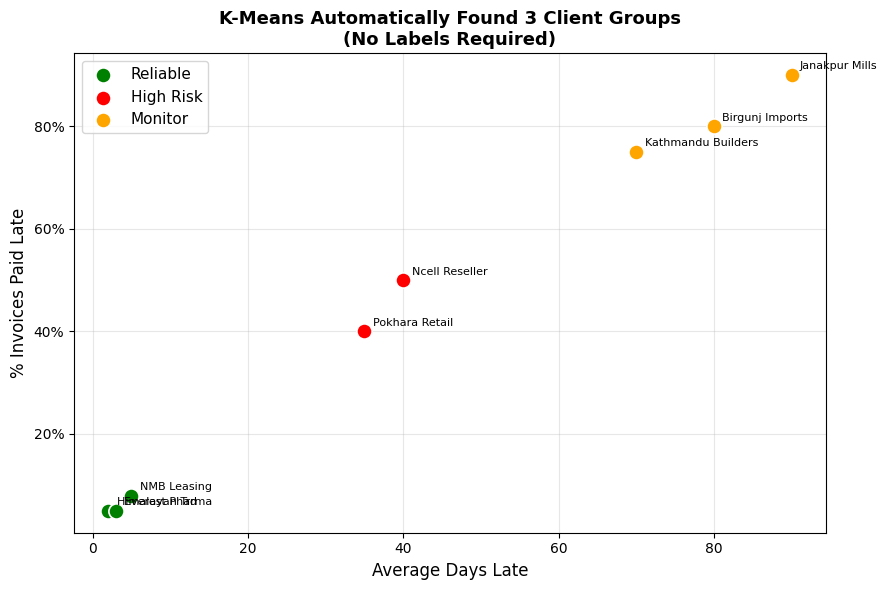

# 🌐 Introduction to Data Science, Machine Learning & AI
**For CA & Finance Professionals — No Coding Background Required**

---

**Course:** ICAN Python & Data Analytics Training  
**Session Duration:** 1.5–2 hours  
**Goal:** Understand what AI, ML, Data Science, and Data Analytics mean —  
and where you as a CA professional fit into this world.

---

## 📋 Table of Contents

| Part | Section | Topic |
|------|---------|-------|
| **Part 1: The Big Picture** | 1 | Artificial Intelligence (AI) |
| | 2 | Machine Learning (ML) |
| | 3 | Data Science |
| | 4 | Data Analytics |
| | 5 | How They All Relate |
| **Part 2: Types of ML** | 6 | Supervised Learning |
| | 7 | Unsupervised Learning |
| | 8 | Reinforcement Learning |
| | 9 | Which Type to Use When? |
| **Part 3: The Workflow** | 10 | From Raw Data to Insight |
| | 11 | Tools You Will Use in This Course |
| **Part 4: See It in Action** | 12 | Supervised — Predict Late Payment |
| | 13 | Unsupervised — Group Clients |
| **Part 5: Practice** | 14 | Quick Check — 10 Questions |

---

---

## Part 1: The Big Picture

---

## Section 1: Artificial Intelligence (AI)

### What is it?

**Artificial Intelligence** is the broad field of making computers do things  
that normally require human intelligence — like recognising a voice, reading  
a document, answering a question, or detecting fraud.

> *"AI is not one technology. It is an umbrella — a goal.  
> The goal is machines that can think, reason, and act intelligently."*

### Nepal CA examples of AI in action today

| Where you've seen AI | What it's doing |
|----------------------|-----------------|
| **Esewa / Khalti fraud detection** | AI flags suspicious transactions in real time |
| **IRD e-filing system** | AI cross-checks VAT returns against purchase registers |
| **Bank loan scoring** | AI reads your income history and approves/rejects instantly |
| **NRB surveillance** | AI monitors foreign exchange transactions for AML compliance |
| **Audit software (CaseWare etc.)** | AI highlights unusual journal entries for auditors |

### What AI is NOT

- Not magic or sentient  
- Not always right (AI makes mistakes too)  
- Not replacing CAs — it replaces **repetitive tasks**, freeing you for **judgement work**

## Section 2: Machine Learning (ML)

### What is it?

**Machine Learning** is the most common way to build AI today.  
Instead of writing rules manually, you **show the machine thousands of examples**  
and it figures out the rules itself.

### Traditional programming vs Machine Learning

```
Traditional Programming:
  Rules + Data  →  Computer  →  Output

  Example: IF invoice > 90 days AND amount > NPR 5L THEN flag as overdue
  Problem: What about 85 days and NPR 4.9L? You need endless rules.

Machine Learning:
  Data + Output  →  Computer  →  Rules (automatically learned)

  Example: Show 10,000 past invoices (paid / unpaid). 
           The model learns which patterns predict non-payment.
  Result:  It handles edge cases you never explicitly wrote.
```

### A simple analogy

Teaching a child to recognise a cat:

- **Traditional programming:** Write rules: has four legs, has fur, has whiskers, meows…
- **Machine learning:** Show the child 1,000 cat photos. They learn the pattern themselves.

ML does the same with numbers.

## Section 3: Data Science

### What is it?

**Data Science** is the discipline of extracting **knowledge and insight** from data.  
It combines three fields:

```
        Statistics
           /\
          /  \
         / DS \
        /______\
  Programming  Domain Knowledge
  (Python, SQL) (Accounting, Finance, Business)
```

**As a CA, you already have Domain Knowledge** — the rarest ingredient.  
This course gives you the Programming piece. Statistics you partly know already.

### What a Data Scientist does

| Step | Activity |
|------|----------|
| 1. Question | Define the business problem (e.g., "Which clients will default?") |
| 2. Collect | Gather data from Tally, ERP, spreadsheets, IRD portal |
| 3. Clean | Fix missing values, duplicates, wrong formats |
| 4. Explore | Charts, summaries — understand what the data is saying |
| 5. Model | Apply ML (predict, cluster, forecast) |
| 6. Communicate | Present findings to management, auditors, regulators |

## Section 4: Data Analytics

### What is it?

**Data Analytics** is more focused than Data Science — it is primarily about  
**understanding what happened and why**, rather than building predictive models.

### The four levels of analytics

| Level | Question answered | Example (Nepal CA context) |
|-------|-------------------|----------------------------|
| **Descriptive** | What happened? | Total VAT collected in FY 2081-82 BS was NPR 28M |
| **Diagnostic** | Why did it happen? | Revenue fell in Mangsir because 3 key clients delayed orders |
| **Predictive** | What will happen? | Client NP0103 has 70% chance of late payment next month |
| **Prescriptive** | What should we do? | Call NP0103 now, reduce credit limit to 30 days |

> **Most CAs today work at Level 1 (Descriptive)** — producing reports.  
> This course takes you to **Level 3 and 4** — predicting and prescribing.

### Data Analytics vs Data Science

| | Data Analytics | Data Science |
|-|---------------|--------------|
| **Focus** | Business insight from existing data | Building models from data |
| **Output** | Dashboards, reports, recommendations | Algorithms, predictions |
| **Tools** | Excel, Power BI, SQL, Python | Python, R, ML libraries |
| **Profile** | CA, business analyst, finance team | Data scientist, ML engineer |

## Section 5: How They All Relate

Think of them as nested circles — each one contains the next:

```
┌─────────────────────────────────────────────────────┐
│                 ARTIFICIAL INTELLIGENCE              │
│   (any technique that makes machines seem smart)     │
│                                                      │
│   ┌──────────────────────────────────────────────┐  │
│   │              MACHINE LEARNING                 │  │
│   │   (machines learn from data, not hard rules)  │  │
│   │                                               │  │
│   │   ┌─────────────────────────────────────┐    │  │
│   │   │           DEEP LEARNING              │    │  │
│   │   │  (multi-layer neural networks —      │    │  │
│   │   │   powers ChatGPT, image recognition) │    │  │
│   │   └─────────────────────────────────────┘    │  │
│   └──────────────────────────────────────────────┘  │
│                                                      │
│   DATA SCIENCE overlaps AI/ML + Statistics + Coding  │
│   DATA ANALYTICS focuses on insight from data        │
└─────────────────────────────────────────────────────┘
```

### Where this course sits

This course covers **Data Analytics + the foundational ML techniques** (Modules 06–10).  
Deep Learning and GenAI (like ChatGPT) are beyond scope — but once you finish  
this course, you'll understand exactly how they work conceptually.

---

## Part 2: Types of Machine Learning

---

## Section 6: Supervised Learning

### The idea

You train a model using **labelled examples** — data where you already know the answer.  
The model learns the relationship between inputs (features) and outputs (labels),  
then predicts the output for new, unseen data.

```
Training phase:
  Past Invoices + [ Late? YES / NO ]  →  Model learns the pattern

Prediction phase:
  New Invoice (no label yet)  →  Model predicts: 72% chance of being late
```

### Two types of supervised learning

| Type | Output | Nepal CA Example |
|------|--------|------------------|
| **Classification** | Category (Yes/No, High/Medium/Low) | Will this invoice be paid late? (Yes/No) |
| **Regression** | Number | How many days late will it be? (e.g., 23 days) |

### Real-world CA use cases

| Problem | Type | What you predict |
|---------|------|------------------|
| Late payment risk | Classification | Late (Yes) or On-time (No) |
| Revenue forecast | Regression | Next quarter revenue in NPR |
| Audit risk scoring | Classification | High / Medium / Low risk |
| Tax liability estimation | Regression | Estimated tax payable in NPR |
| Fraud detection | Classification | Fraudulent (Yes) or Genuine (No) |

> **Algorithms used:** Logistic Regression, Random Forest, Decision Tree,  
> Gradient Boosting, Linear Regression — covered in Module 09.

## Section 7: Unsupervised Learning

### The idea

There are **no labels** — you don't tell the model the answers.  
It discovers hidden patterns or groupings in the data on its own.

```
Input:
  200 clients with: payment history, invoice size, tenure, credit days
  (no labels — you haven't categorised them)

Output (discovered automatically):
  Group A: 52 clients — fast payers, large invoices, long tenure
  Group B: 71 clients — occasional delays, medium invoices
  Group C: 38 clients — frequent late payments, short tenure
  Group D: 37 clients — very high risk, inconsistent
```

### Types of unsupervised learning

| Type | What it does | Nepal CA Example |
|------|-------------|------------------|
| **Clustering** | Groups similar data points | Segment clients by payment behaviour |
| **Dimensionality Reduction** | Simplifies many features into fewer | Compress 50 financial ratios into 3 key dimensions |
| **Anomaly Detection** | Finds unusual outliers | Flag journal entries that don't fit normal patterns |

> **Algorithms used:** K-Means (Module 10), PCA, Isolation Forest

## Section 8: Reinforcement Learning

### The idea

An **agent** learns by **trial and error** — taking actions, receiving rewards  
or penalties, and gradually improving its strategy. There is no dataset to train on;  
the agent generates its own experience.

```
Agent (e.g., a trading bot)
     ↓  takes action (buy / sell / hold)
Environment (stock market)
     ↓  gives reward (+profit) or penalty (-loss)
Agent updates its strategy
     ↓  repeat thousands of times
Result: agent learns optimal strategy over time
```

### Famous examples

| Example | What the agent learned |
|---------|------------------------|
| **AlphaGo (DeepMind)** | Beat the world champion at Go by playing millions of games against itself |
| **ChatGPT (RLHF)** | Learned to give better answers based on human feedback (thumbs up/down) |
| **Algorithmic trading** | Learns to buy/sell securities to maximise portfolio return |
| **Robotics** | Robot arm learns to pick objects by trying thousands of times |

### CA relevance

Reinforcement Learning is mostly used in **robotics, gaming, and trading systems**.  
As a CA, you are unlikely to build RL systems yourself — but you will encounter them  
in **algorithmic trading audits**, **robo-advisory compliance**, and **fintech regulation**.

> SEBON Nepal is beginning to develop guidelines for algorithmic trading systems —  
> understanding RL conceptually will help you audit and advise these clients.

## Section 9: Which Type to Use When?

| Situation | Right approach | Why |
|-----------|----------------|-----|
| You have historical data with known outcomes | **Supervised** | You can train on past labels |
| You have data but no labels / categories | **Unsupervised** | Let the algorithm find structure |
| You want to segment customers/expenses | **Unsupervised (Clustering)** | No need for predefined groups |
| You want to predict a number (revenue, tax) | **Supervised (Regression)** | Output is continuous |
| You want to predict a category (fraud/not) | **Supervised (Classification)** | Output is a class |
| You want a system to optimise over time | **Reinforcement** | No dataset, learns by doing |

### Decision flowchart

```
Do you have labelled data (known outcomes)?
     |
    YES ──→ SUPERVISED
     |         ├── Predict a number?  → Regression
     |         └── Predict a class?   → Classification
     |
    NO  ──→ UNSUPERVISED
               ├── Find groups?         → Clustering (K-Means)
               ├── Find outliers?       → Anomaly Detection
               └── Simplify features?  → Dimensionality Reduction (PCA)
```

---

## Part 3: The Data Science Workflow

---

## Section 10: From Raw Data to Insight

Every real data science project follows roughly the same sequence of steps.  
Module 06 covers this in detail (CRISP-DM). Here is the high-level picture:

```
1. DEFINE THE PROBLEM
   └── "Which of our 200 debtors are at risk of not paying next month?"

2. COLLECT THE DATA
   └── Export from Tally / ERP: invoice dates, amounts, payment history

3. CLEAN THE DATA          ← Module 07
   └── Fix missing values, duplicates, wrong dates, currency format errors

4. EXPLORE THE DATA        ← Modules 03, 04, 05
   └── Charts, pivot tables, summary statistics — understand the data

5. ENGINEER FEATURES       ← Module 08
   └── Create new columns: days_overdue, late_rate, invoice_vs_industry_avg

6. BUILD THE MODEL         ← Modules 09, 10
   └── Train Logistic Regression / Random Forest / K-Means

7. EVALUATE
   └── Accuracy, silhouette score, ROC-AUC — is the model good enough?

8. ACT ON INSIGHTS
   └── Export to Excel, share with collection team, update credit policy
```

> **As a CA**, Steps 1, 2, 8 are already your strength.  
> This course trains you for Steps 3–7.

## Section 11: Tools You Will Use in This Course

| Tool | What it is | When you use it |
|------|-----------|------------------|
| **Python** | Programming language | Everything — the foundation |
| **Jupyter Notebook** | Interactive coding environment | Write and run code cell by cell |
| **NumPy** | Fast number crunching | Arrays, matrices, NPV/IRR (Module 02) |
| **Pandas** | Data tables (like Excel, but faster) | Import, clean, reshape data (Module 03) |
| **Matplotlib** | Charts and graphs | Line, bar, pie, waterfall charts (Module 04) |
| **Seaborn** | Statistical visualisation | Heatmaps, distributions, outlier detection (Module 05) |
| **scikit-learn** | Machine learning library | Classification, clustering, feature engineering (Modules 08–10) |

### How they relate

```
Python  ──┬──  NumPy    (numbers and maths)
          ├──  Pandas   (tables of data)
          ├──  Matplotlib / Seaborn  (charts)
          └──  scikit-learn  (machine learning)
               ├── Preprocessing (StandardScaler, LabelEncoder)
               ├── Models (LogisticRegression, RandomForest, KMeans)
               └── Evaluation (accuracy_score, roc_auc_score, silhouette_score)
```

Install everything at once:
```bash
pip install numpy pandas matplotlib seaborn scikit-learn jupyterlab openpyxl
```

---

## Part 4: See It in Action

*Two tiny examples — just enough to show what ML code looks like.*

---

## Section 12: Supervised — Predict Late Payment

We create a tiny dataset of 10 invoices, train a classifier,  
and predict whether a new invoice will be paid late.


```python
import pandas as pd
from sklearn.tree import DecisionTreeClassifier

# --- 10 past invoices (our training data) ---
# Features: [Days overdue last time, Invoice amount (NPR 000s), Credit days]
# Label:    1 = was paid LATE,  0 = paid ON TIME
past_data = pd.DataFrame({
    'prev_delay_days': [0,  5,  0, 45, 30,  0, 60, 10,  0, 90],
    'invoice_NPR_000': [50, 80, 30,200,150, 20,500, 90, 45,800],
    'credit_days':     [30, 45, 30, 60, 60, 30, 90, 45, 30, 90],
    'was_late':        [ 0,  0,  0,  1,  1,  0,  1,  0,  0,  1],  # label
})

# --- Train the model ---
X_train = past_data[['prev_delay_days', 'invoice_NPR_000', 'credit_days']]
y_train = past_data['was_late']

model = DecisionTreeClassifier(max_depth=3, random_state=42)
model.fit(X_train, y_train)

# --- Predict for 3 new invoices ---
new_invoices = pd.DataFrame({
    'Client':           ['Himalayan Trading', 'Everest Pharma', 'Kathmandu Builders'],
    'prev_delay_days':  [0,                   35,                70],
    'invoice_NPR_000':  [40,                  180,               600],
    'credit_days':      [30,                  60,                90],
})
X_new = new_invoices[['prev_delay_days', 'invoice_NPR_000', 'credit_days']]

new_invoices['Prediction'] = model.predict(X_new)
new_invoices['Prediction'] = new_invoices['Prediction'].map({0: 'On Time ✓', 1: 'LATE ✗'})

print('=== Supervised Learning: Late Payment Prediction ===')
print(new_invoices[['Client', 'prev_delay_days', 'invoice_NPR_000', 'Prediction']]
      .to_string(index=False))
print()
print('The model learned this pattern from 10 past invoices.')
print('In Module 09, we train on 900 invoices for much higher accuracy.')

```

    === Supervised Learning: Late Payment Prediction ===
                Client  prev_delay_days  invoice_NPR_000 Prediction
     Himalayan Trading                0               40  On Time ✓
        Everest Pharma               35              180     LATE ✗
    Kathmandu Builders               70              600     LATE ✗
    
    The model learned this pattern from 10 past invoices.
    In Module 09, we train on 900 invoices for much higher accuracy.


## Section 13: Unsupervised — Group Clients Automatically

No labels. We give the algorithm 8 clients and ask it to form 3 natural groups  
based on their payment behaviour. The algorithm decides who belongs together.


```python
import numpy as np
import matplotlib.pyplot as plt
from sklearn.cluster import KMeans
from sklearn.preprocessing import StandardScaler

# 8 clients: [avg days late, fraction of invoices paid late]
clients = pd.DataFrame({
    'Client':         ['Himalayan Trd', 'NMB Leasing', 'Everest Pharma',
                       'Pokhara Retail', 'Ncell Reseller', 'Kathmandu Builders',
                       'Birgunj Imports', 'Janakpur Mills'],
    'avg_delay_days': [2,   5,  3,  35, 40,  70, 80,  90],
    'late_rate':      [0.05,0.08,0.05,0.40,0.50,0.75,0.80,0.90],
})

X = StandardScaler().fit_transform(clients[['avg_delay_days', 'late_rate']])

# K-Means finds 3 groups automatically
km = KMeans(n_clusters=3, random_state=42, n_init=10)
clients['Group'] = km.fit_predict(X)

GROUP_NAMES = {0: 'Reliable', 1: 'Monitor', 2: 'High Risk'}
GROUP_COLORS = {'Reliable': 'green', 'Monitor': 'orange', 'High Risk': 'red'}

clients['Segment'] = clients['Group'].map(lambda g: GROUP_NAMES.get(g, f'Group {g}'))

print('=== Unsupervised Learning: Client Segmentation ===')
print('No labels were given — the model found these groups on its own:\n')
for seg in clients['Segment'].unique():
    members = clients[clients['Segment'] == seg]['Client'].tolist()
    avg_d = clients[clients['Segment'] == seg]['avg_delay_days'].mean()
    avg_r = clients[clients['Segment'] == seg]['late_rate'].mean()
    print(f'  {seg:12s}: {members}')
    print(f'               avg delay={avg_d:.0f}d, late rate={avg_r:.0%}')
    print()

# Plot
fig, ax = plt.subplots(figsize=(9, 6))
for seg in clients['Segment'].unique():
    mask = clients['Segment'] == seg
    ax.scatter(
        clients.loc[mask, 'avg_delay_days'],
        clients.loc[mask, 'late_rate'] * 100,
        c=GROUP_COLORS.get(seg, 'blue'), s=120, label=seg,
        edgecolors='white', linewidth=1.2, zorder=3
    )
    for _, row in clients[mask].iterrows():
        ax.annotate(row['Client'],
                    (row['avg_delay_days'], row['late_rate']*100),
                    textcoords='offset points', xytext=(6, 4), fontsize=8)

ax.set_xlabel('Average Days Late', fontsize=12)
ax.set_ylabel('% Invoices Paid Late', fontsize=12)
ax.set_title('K-Means Automatically Found 3 Client Groups\n'
             '(No Labels Required)', fontsize=13, fontweight='bold')
ax.legend(fontsize=11)
ax.grid(True, alpha=0.3)
ax.yaxis.set_major_formatter(plt.FuncFormatter(lambda x, _: f'{x:.0f}%'))
plt.tight_layout()
plt.savefig('intro_clustering_demo.png', dpi=120, bbox_inches='tight')
plt.show()
print('In Module 10, we do this with 200 real clients and 6 features.')

```

    === Unsupervised Learning: Client Segmentation ===
    No labels were given — the model found these groups on its own:
    
      Reliable    : ['Himalayan Trd', 'NMB Leasing', 'Everest Pharma']
                   avg delay=3d, late rate=6%
    
      High Risk   : ['Pokhara Retail', 'Ncell Reseller']
                   avg delay=38d, late rate=45%
    
      Monitor     : ['Kathmandu Builders', 'Birgunj Imports', 'Janakpur Mills']
                   avg delay=80d, late rate=82%
    


    

    


    In Module 10, we do this with 200 real clients and 6 features.


---

## Part 5: Practice

---

## Section 14: Quick Check — Test Your Understanding

Answer these 10 questions without looking back. Check your answers below.

---

**Q1.** AI, Machine Learning, and Deep Learning are all the same thing. **True or False?**

**Q2.** In traditional programming you write the rules. In machine learning, _______ learns the rules.

**Q3.** A CA wants to predict whether a client will default on payment.  
Is this Supervised or Unsupervised learning? And is it Regression or Classification?

**Q4.** A CA wants to group 500 expense transactions into natural categories  
without manually labelling them. Which type of ML should they use?

**Q5.** What is the difference between Descriptive Analytics and Predictive Analytics?  
Give one Nepal CA example of each.

**Q6.** Name the three ingredients of Data Science.

**Q7.** Which Python library would you use to: (a) create a bar chart, (b) load an Excel file,  
(c) train a K-Means model?

**Q8.** AlphaGo learned to play the board game Go by playing millions of games against itself.  
Which type of ML is this?

**Q9.** You have 1,000 audit journal entries and want to automatically flag unusual ones  
without knowing in advance what 'unusual' looks like. Which ML approach?

**Q10.** As a CA, you already have one of the three Data Science ingredients.  
What is it, and why is it the rarest?

---

### 💡 Answers

**A1.** False. They are nested: AI ⊃ Machine Learning ⊃ Deep Learning.  
Deep Learning is a specific type of ML, which is itself a specific approach to AI.

**A2.** The machine (model) learns the rules from data.

**A3.** Supervised Learning → Classification  
(You have past examples labelled 'defaulted' or 'paid'. Output is a category.)

**A4.** Unsupervised Learning — specifically Clustering (e.g., K-Means).  
No labels are needed; the algorithm finds natural groups.

**A5.**  
- *Descriptive:* "Total VAT collected in FY 2081-82 BS was NPR 28M" (what happened)  
- *Predictive:* "Based on this quarter's invoicing pattern, Q4 revenue will be NPR 8.2M" (what will happen)

**A6.** Statistics + Programming (Python/R/SQL) + Domain Knowledge (your field)

**A7.** (a) Matplotlib or Seaborn  (b) Pandas  (c) scikit-learn

**A8.** Reinforcement Learning — the agent (AlphaGo) learned by trial and error, receiving  
rewards (win) and penalties (loss), with no labelled dataset.

**A9.** Unsupervised Learning — Anomaly Detection.  
Since you don't know what 'unusual' looks like in advance, you can't label training data.

**A10.** Domain Knowledge — accounting, finance, tax, and regulatory expertise.  
This is the rarest because it takes years of professional training and cannot be easily automated.  
Data scientists can learn to code; they cannot easily acquire CA-level financial expertise.

---

## What's Next?

You now have the conceptual foundation. The rest of the course builds the practical skills:

| Module | What you'll build |
|--------|-------------------|
| **01 Python Basics** | Tax calculator, invoice processor, payroll tool |
| **02 NumPy** | Vectorised VAT, NPV/IRR, portfolio analysis |
| **03 Pandas** | DataFrames, pivot tables, VLOOKUP replacement |
| **04 Matplotlib** | Line, bar, waterfall, dashboard charts |
| **05 Seaborn** | Statistical charts, heatmaps, outlier detection |
| **06 CRISP-DM** | Full data analytics project methodology |
| **07 Data Cleaning** | Fix real-world messy financial data |
| **08 Feature Engineering** | Create predictive features from raw transactions |
| **09 Regression & Classification** | Predict late payments, risk scoring |
| **10 Clustering** | Segment clients, cluster AR aging, export to Excel |

---

*ICAN Python & Data Analytics Training — Module 00*  
*Instructor: Aayush Raj Regmi*
