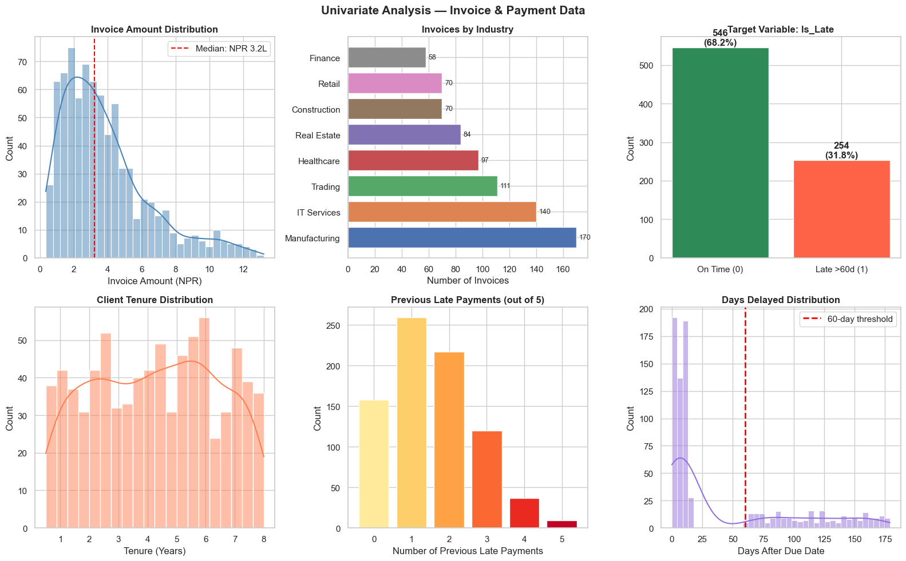
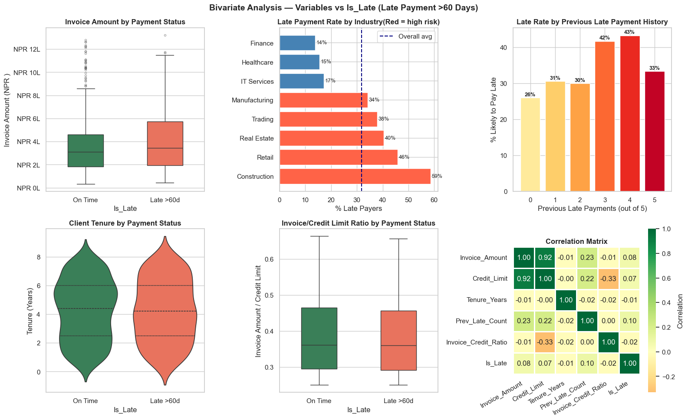
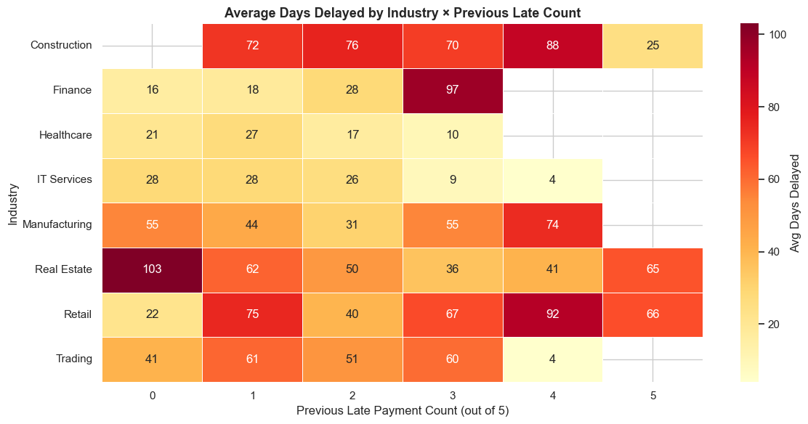

# 📐 Module 06: The Data Analytics Process
**CRISP-DM — From Business Problem to Actionable Insight**

---

**Pre-requisite:** Modules 01–05 (Python, NumPy, Pandas, Matplotlib, Seaborn)  
**Estimated time:** 3–4 hours  
**Session structure:** Why Process → CRISP-DM Framework → 6 Phases in Depth → Hands-on Case Study → Practice

---

## 📋 Table of Contents

| Part | Section | Topic |
|------|---------|-------|
| **Part 1: Why Process?** | 1 | The Danger of Jumping Straight to Analysis |
| | 2 | How CA Professionals Already Think in Processes |
| **Part 2: CRISP-DM** | 3 | What is CRISP-DM? — History & Overview |
| | 4 | The 6 Phases at a Glance |
| **Part 3: Phases in Depth** | 5 | Phase 1 — Business Understanding |
| | 6 | Phase 2 — Data Understanding |
| | 7 | Phase 3 — Data Preparation |
| | 8 | Phase 4 — Modelling |
| | 9 | Phase 5 — Evaluation |
| | 10 | Phase 6 — Deployment |
| **Part 4: Hands-on Case Study** | 11 | The Business Problem: Late Payment Prediction |
| | 12 | Phase 1 in Python: Problem Charter |
| | 13 | Phase 2 in Python: Data Profiling |
| | 14 | Phase 2 in Python: Quality Assessment |
| | 15 | Phase 2 in Python: Univariate Analysis |
| | 16 | Phase 2 in Python: Bivariate Analysis |
| | 17 | Phase 3 Preview: What Preparation Looks Like |
| | 18 | Phases 4–6 Preview: Modelling & Beyond |
| **Part 5: Practice** | 19 | Practice Exercises |

---

## Part 1: Why Process Matters

## Section 1: The Danger of Jumping Straight to Analysis

### The most common analytics failure

A junior analyst at a manufacturing firm is asked: *"Why are our profits falling?"*

He opens the ERP export in Python, runs a correlation analysis in 20 minutes, and reports: *"Salaries are the problem — they correlate 0.82 with falling profit."*

The MD cuts 30 people. Profits keep falling.

Three months later, someone notices the real issue: a single large client stopped paying on time, and the credit terms given to that client were making the revenue look fine on paper while cash eroded quietly.

**What went wrong?**

1. The analyst never **defined the business problem** precisely
2. He never asked *"what data do we actually need?"* before grabbing what was available
3. He jumped to modelling before **understanding the data**
4. He never evaluated whether the model answered the right question
5. There was no structured **deployment** — the insight was a one-off report with no follow-up mechanism

### The pattern is universal

| Skipped step | What goes wrong |
|---|---|
| Business Understanding | Solve the wrong problem with great accuracy |
| Data Understanding | Miss key variables; trust dirty data |
| Data Preparation | Garbage in, garbage out — model learns noise |
| Modelling | Pick the wrong algorithm; overfit |
| Evaluation | Deploy a model that looks good on training data but fails in production |
| Deployment | Insight dies in a PDF; no one acts on it |

### The $3 billion lesson

In 2012, JPMorgan Chase lost over $6 billion in the "London Whale" trading incident. A key contributing factor: risk models built on copy-pasted Excel spreadsheets with formula errors that underestimated risk by a factor of 2. A structured analytics process with proper data validation would have caught it.

> **A structured process is not bureaucracy. It is professional discipline — the same discipline you apply in audit, tax, and assurance work.**

## Section 2: How CA Professionals Already Think in Processes

Here is a revelation: **you already follow a data analytics process**. You just call it something else.

### The audit parallel

| Audit Step | CRISP-DM Equivalent |
|-----------|---------------------|
| Engagement planning — understand client, risk, materiality | **Business Understanding** — define the problem, KPIs, success criteria |
| Preliminary analytical procedures — review financial statements | **Data Understanding** — profile data, identify anomalies |
| Sampling, vouching, confirmation | **Data Preparation** — select, clean, transform data |
| Substantive testing, ratio analysis | **Modelling** — apply analytical techniques |
| Forming an opinion | **Evaluation** — does the result answer the question? Is it reliable? |
| Audit report + management letter | **Deployment** — communicate findings; build into ongoing processes |

### The tax planning parallel

| Tax Planning Step | CRISP-DM Equivalent |
|---|----|
| Understand client's business and goals | Business Understanding |
| Gather income, expense, investment data | Data Understanding |
| Classify, reconcile, compute taxable income | Data Preparation |
| Apply deductions, apply slab / rate | Modelling |
| Verify computation against laws | Evaluation |
| File return; update for advance tax | Deployment |

### Why this matters

You are not learning something foreign. You are learning to apply the professional discipline you already have to a new domain — data analytics — and to execute it with Python rather than Excel and judgement alone.

> **CRISP-DM makes implicit good practice explicit and repeatable.**

## Part 2: The CRISP-DM Framework

## Section 3: What is CRISP-DM? — History & Overview

### Origin

**CRISP-DM** stands for **CR**oss-**I**ndustry **S**tandard **P**rocess for **D**ata **M**ining.

It was developed in **1996** by a European consortium:
- **DaimlerChrysler** (automotive analytics)
- **SPSS** (statistical software, now IBM)
- **NCR** (data warehousing)

The goal was a **vendor-neutral, industry-neutral** process that any organisation could use for any data analytics or data mining project. It was formally published in **2000** and remains the most widely adopted analytics methodology in the world.

> A 2014 KDnuggets poll found **43% of analytics practitioners** use CRISP-DM — more than all other methodologies combined.

### Why CRISP-DM and not something else?

| Framework | Origin | Best for |
|-----------|--------|---------|
| **CRISP-DM** | Industry consortium, 2000 | General analytics projects — **most universal** |
| KDD | Academic, 1996 | Research / academic data mining |
| SEMMA | SAS Institute | SAS-specific workflows |
| TDSP | Microsoft, 2016 | Large enterprise ML teams |
| Agile DS | Various | Iterative, fast-cycle projects |

CRISP-DM wins for finance professionals because:
1. It is **not tied to any software**
2. It explicitly includes **business understanding** as the first phase — most frameworks skip this
3. It is **cyclical** — you are expected to loop back, just like in audit
4. It has been validated across thousands of real projects

### The cyclical nature

CRISP-DM is not a waterfall. It is a **cycle**:

```
         ┌─────────────────────────────────────┐
         │          Business Understanding      │
         │                  ↓                  │
         │          Data Understanding          │
         │                  ↓                  │
         │          Data Preparation            │◄──┐
         │                  ↓                  │   │ Loop back
         │             Modelling               │   │ when needed
         │                  ↓                  │   │
         │             Evaluation              │───┘
         │                  ↓                  │
         │            Deployment               │
         └─────────────────────────────────────┘
                            ↑
                    And then repeat
                  (new question emerges)
```

After deployment, new questions arise. The cycle begins again.

## Section 4: The 6 Phases at a Glance

```
╔══════════════════════════════════════════════════════════════════════════════╗
║  Phase 1: BUSINESS UNDERSTANDING                                            ║
║  What are we actually trying to solve?                                      ║
║  • Define the business objective                                            ║
║  • Set success criteria (quantifiable KPIs)                                ║
║  • Identify data requirements                                               ║
╠══════════════════════════════════════════════════════════════════════════════╣
║  Phase 2: DATA UNDERSTANDING                                                ║
║  What data do we have, and is it trustworthy?                               ║
║  • Collect and inventory data sources                                       ║
║  • Profile: shape, types, completeness                                      ║
║  • Identify quality issues                                                  ║
║  • Explore distributions, correlations, outliers                           ║
╠══════════════════════════════════════════════════════════════════════════════╣
║  Phase 3: DATA PREPARATION                                                  ║
║  Transform raw data into analysis-ready data.                               ║
║  • Select relevant columns/rows                                             ║
║  • Handle missing values, duplicates, outliers                             ║
║  • Engineer new features (ratios, flags, date components)                  ║
║  • Encode categoricals, scale numerics                                     ║
╠══════════════════════════════════════════════════════════════════════════════╣
║  Phase 4: MODELLING                                                         ║
║  Apply statistical or ML techniques to the prepared data.                  ║
║  • Select model type (regression, classification, clustering…)             ║
║  • Split data (train/test)                                                  ║
║  • Fit the model                                                            ║
║  • Tune parameters                                                          ║
╠══════════════════════════════════════════════════════════════════════════════╣
║  Phase 5: EVALUATION                                                        ║
║  Does the model actually solve the business problem?                        ║
║  • Measure model performance (RMSE, accuracy, AUC…)                        ║
║  • Check against business success criteria from Phase 1                    ║
║  • Identify limitations; decide whether to proceed                         ║
╠══════════════════════════════════════════════════════════════════════════════╣
║  Phase 6: DEPLOYMENT                                                        ║
║  Turn the insight into action.                                              ║
║  • Automate the analysis (scheduled script)                                 ║
║  • Build a report / dashboard                                               ║
║  • Document findings for audit trail                                        ║
║  • Plan for model monitoring and refresh                                   ║
╚══════════════════════════════════════════════════════════════════════════════╝
```

**Time allocation in real projects:**

| Phase | Typical time share |
|-------|--------------------|
| Business Understanding | 5–10% |
| Data Understanding | 15–20% |
| **Data Preparation** | **50–60%** ← usually the biggest effort |
| Modelling | 10–15% |
| Evaluation | 5–10% |
| Deployment | 5–10% |

> This is why Modules 07 and 08 (Data Cleaning & Feature Engineering) are so important — they represent the majority of real analytics work.

## Part 3: The 6 Phases in Depth

## Section 5: Phase 1 — Business Understanding

### The most important phase — and the most skipped

Every failed analytics project shares one root cause: the analyst did not spend enough time understanding **what the business actually needs**.

It is tempting to jump to data immediately. The data is concrete; the business problem feels vague. Resist this temptation.

### Four questions to answer in Phase 1

**1. What is the business objective?**  
Not "analyse sales data." Instead:  
*"Identify which of our 450 active clients are likely to delay payment beyond 60 days so that we can prioritise collection calls in the first week of each month."*

**2. What does success look like — in numbers?**  
- "The model should flag at least 80% of actual late payers (recall ≥ 80%)"
- "The analysis should be repeatable monthly with minimal manual effort"
- "Output: a ranked list of at-risk clients, updated by the 3rd of each month"

**3. What data do we need — and do we have it?**
- Payment history for the last 2 years
- Client industry, size, credit limit
- Invoice amounts and due dates
- Any previous collection actions

**4. What are the constraints?**
- Data privacy / client confidentiality
- Timeline: result needed before next billing cycle
- Resource: one analyst, no dedicated ML infrastructure

### The Project Charter (your Phase 1 output)

Every analytics project should begin with a one-page charter:

| Field | Example |
|-------|---------|
| **Business Question** | Which clients are likely to delay payment >60 days? |
| **Why it matters** | NPR 1.2 Cr currently overdue; cash flow pressure on payroll |
| **Success Metric** | Recall ≥ 80% on 3-month holdout test |
| **Data Required** | Invoice register, payment log, client master |
| **Data Source** | ERP (Tally/SAP export), internal CRM |
| **Timeline** | Analysis complete by end of month |
| **Stakeholder** | CFO / Accounts Receivable team |
| **Analyst** | [Your name] |
| **Constraints** | Client data must stay within firm's systems |

### Common Phase 1 mistakes

| Mistake | Consequence |
|---------|-------------|
| Vague objective ("analyse the data") | No way to know when you're done |
| No success metric | Cannot evaluate whether the project succeeded |
| Not checking data availability | Build the analysis, then discover you lack key data |
| Skipping stakeholder alignment | Deliver an answer to the wrong question |

## Section 6: Phase 2 — Data Understanding

### The detective phase

Phase 2 is where you **meet your data for the first time**. Your job is to understand it deeply before touching it — like an auditor reading through a set of accounts before designing substantive tests.

### Four activities in Data Understanding

**1. Data Collection & Inventory**
- What data sources exist? (ERP, CRM, Excel files, bank statements, IRD VAT portal exports)
- What is the format? (CSV, Excel, SQL database, API)
- What time period does it cover?
- How was it collected? (Manual entry? Automated system? Both?)

**2. Data Profiling** (descriptive statistics for every column)
- How many rows and columns?
- What data type is each column?
- How many missing values per column?
- What is the range, mean, median for numeric columns?
- What are the unique values for categorical columns?

**3. Data Quality Assessment**
| Quality dimension | Question to ask |
|---|---|
| **Completeness** | Are there missing values? Which columns? How many? |
| **Accuracy** | Do the values make sense? (Negative amounts? Future dates?) |
| **Consistency** | Same entity represented differently? ("Tata Ltd" vs "TATA LIMITED") |
| **Timeliness** | Is the data current enough for the question? |
| **Uniqueness** | Are there duplicate records? |

**4. Initial Exploration**
- Distributions: are numeric columns normally distributed or skewed?
- Outliers: are there extreme values that seem like errors?
- Correlations: which variables move together?
- Class balance (for classification): is the target 50/50 or 95/5?

### Key Python tools for Phase 2

```python
df.shape           # rows × columns
df.info()          # column types, non-null counts
df.describe()      # min, max, mean, std, quartiles
df.isnull().sum()  # missing value count per column
df.duplicated().sum()  # duplicate row count
df['col'].value_counts()   # frequency of each category
df.corr()          # correlation matrix
```

> You will use all of these in Section 13–16 of this module's hands-on case study.

## Section 7: Phase 3 — Data Preparation

### The largest phase — and the most underestimated

Data preparation is where **50–60% of analytics project time** is spent. In most real-world datasets, the data is not clean. It has:
- Missing values (cells not filled)
- Errors (negative age, future invoice dates, duplicate records)
- Inconsistencies (same client with 4 different name spellings)
- Wrong types (amount stored as "NPR 1,20,000" text instead of a number)
- Irrelevant columns (dozens of columns that add no predictive value)

### The five tasks of Data Preparation

**1. Data Selection**
- Which rows do we need? (Only FY 2080-81 BS? Only settled invoices?)
- Which columns are relevant to the business question?
- Remove columns with too many missing values or near-zero variance

**2. Data Cleaning**
- Handle missing values: fill with mean/median/mode, or drop
- Remove or fix duplicate records
- Correct data types
- Standardise text (strip spaces, uniform case, remove special chars)
- Handle outliers: cap, remove, or investigate

**3. Data Construction (Feature Engineering)**
- Create new columns that capture business insight:
  - `payment_delay_days = payment_date - due_date`
  - `invoice_to_revenue_ratio = invoice_amount / monthly_revenue`
  - `days_since_last_payment` (recency feature)
  - `is_high_value = invoice_amount > 500000` (binary flag)
- Extract date components: month, quarter, day-of-week

**4. Data Transformation**
- Encode categoricals: convert 'Industry' text to numbers (OneHotEncoding)
- Scale numerics: standardise (mean=0, std=1) or normalise (0 to 1) — needed for some models
- Handle skewed distributions (log transform for invoice amounts)

**5. Data Integration**
- Merge multiple sources: join invoice register + client master + payment log
- Create the final analysis-ready dataset with one row per observation

> **Module 07 covers Data Cleaning and Module 08 covers Feature Engineering in full detail.**

## Section 8: Phase 4 — Modelling

### Choosing the right tool for the right job

Once data is prepared, you select and apply a **statistical or machine learning model**. The choice depends on what you are trying to do:

| Business Question | Model Type | Example |
|---|---|---|
| *"How much will revenue be next quarter?"* | **Regression** | Linear Regression, Random Forest Regressor |
| *"Will this client default?"* | **Classification** | Logistic Regression, Decision Tree |
| *"Which clients are similar to each other?"* | **Clustering** | K-Means, DBSCAN |
| *"Is this invoice unusual?"* | **Anomaly Detection** | Isolation Forest, Z-score |
| *"Which variables drive profit most?"* | **Feature Importance** | Random Forest, SHAP values |

### The modelling workflow

```
Prepared Data
      │
      ▼
 Train/Test Split   ← Divide data: 80% train, 20% test
      │                (NEVER evaluate on training data)
      ▼
 Feature Selection  ← Which columns to include as inputs?
      │
      ▼
 Model Training     ← Fit the model on training data
      │
      ▼
 Hyperparameter     ← Tune the model's settings
    Tuning               (cross-validation)
      │
      ▼
 Prediction on      ← Generate predictions on unseen test data
   Test Set
```

### The golden rule: never evaluate on training data

A model "memorises" the training data. Evaluating it on the same data is like giving a student the exam answers, then testing them — they will score 100% but cannot actually solve new problems.

**Always set aside a test set the model has never seen.**

> **Modules 09 (Regression) and 10 (Classification) cover this in full detail.**

## Section 9: Phase 5 — Evaluation

### Does the model actually answer the business question?

Evaluation has two layers:

**Layer 1: Technical performance** — did the model learn well?

| Task | Metric | What it means |
|------|--------|---------------|
| Regression | RMSE | Average error in the predicted unit (NPR ) |
| Regression | R² | % of variance explained (1.0 = perfect) |
| Classification | Accuracy | % of predictions correct |
| Classification | Precision | Of predicted positives, how many were truly positive? |
| Classification | Recall | Of actual positives, how many did we catch? |
| Classification | AUC-ROC | Overall ability to rank positives above negatives |
| Clustering | Silhouette Score | How well-separated the clusters are |

**Layer 2: Business validity** — does the technical result answer the business question?

A model can have 95% accuracy and still be useless. Example:
- 95% of invoices are paid on time → if you predict "always paid on time," you get 95% accuracy
- But you missed 100% of the late payers — which was the entire point

**Always return to the success criteria defined in Phase 1.**

### Evaluation questions to ask

1. Does the model's performance meet the Phase 1 success threshold?
2. Is the model interpretable enough for a non-technical stakeholder (CFO, audit partner)?
3. Are there subgroups where the model performs poorly? (e.g., fails for clients in a specific industry)
4. What are the consequences of false positives vs false negatives?
5. Is the model stable across different time periods?

> **Model evaluation is covered in detail within each of Modules 09, 10, and 11.**

## Section 10: Phase 6 — Deployment

### Turning insight into action

The most under-appreciated phase. A brilliant analysis that sits in a Jupyter notebook and is read once by the analyst has zero business value. Deployment means making the insight **repeatable, actionable, and sustainable**.

### Deployment options for a CA firm

| Deployment form | When to use | Tools |
|---|---|---|
| **Automated report** | Recurring analysis (monthly VAT Return reconciliation, debtors ageing) | Python + openpyxl / reportlab |
| **Excel / CSV output** | Hand-off to finance team | `df.to_excel()` |
| **PDF report** | Partner / client deliverable | reportlab, fpdf2 |
| **Interactive dashboard** | Self-service for management | Streamlit, Dash, Power BI |
| **Scheduled script** | Runs automatically on a schedule | Windows Task Scheduler, cron |
| **API / integration** | Feed into ERP / accounting software | Flask, FastAPI |

### Deployment checklist

- [ ] Code is documented and reproducible (another person can run it)
- [ ] Input data source is stable and access is maintained
- [ ] Output format is agreed with the stakeholder
- [ ] Error handling: what happens if data is missing one month?
- [ ] Model refresh schedule: when will the model be retrained? (quarterly? annually?)
- [ ] Monitoring: how will you detect if model performance degrades?
- [ ] Audit trail: outputs are logged with date, version, and analyst name

### The CA's deployment advantage

As a CA, you already understand:
- Client confidentiality and data governance
- Audit documentation and version control
- Materiality — what level of error is acceptable?
- Professional scepticism — when to question a model's output

These skills make CA professionals **exceptionally well-placed** to deploy analytics responsibly in a regulated environment.

> *"The goal is not to build a model. The goal is to change a decision."*

## Part 4: Hands-on Case Study

## Section 11: The Business Problem — Late Payment Prediction

### Scenario

You work in the finance team of **Himalayan Advisory Services Pvt Ltd**, a mid-sized consulting firm with 320 active clients. The CFO has raised a concern:

> *"We have NPR 1.8 crores in receivables overdue beyond 60 days. I want to know BEFORE an invoice is due whether a client is likely to pay late — so we can follow up proactively."*

### Phase 1 — Business Understanding (completed)

You have already had a 30-minute discussion with the CFO. Here is the Project Charter:

| Field | Detail |
|-------|--------|
| **Business Question** | Which clients with open invoices are most likely to delay payment beyond 60 days? |
| **Why it matters** | NPR 22 million overdue; working capital strain; payroll pressure |
| **Success Metric** | Model should catch ≥ 75% of actual late payers (Recall ≥ 75%) |
| **Data Required** | Invoice register, payment history, client master (industry, size, tenure) |
| **Data Source** | ERP export (last 2 years), client CRM |
| **Timeline** | Prototype in 2 weeks; full deployment by month-end |
| **Stakeholder** | CFO — wants a monthly Excel file with risk-ranked client list |
| **Output Format** | Excel report: client name, invoice amount, predicted risk score, recommended action |
| **Constraints** | Data stays internal; no third-party tools |

In the following sections, we walk through **Phases 2 and 3** hands-on using Python.


```python
# Setup — import all libraries needed for this module
import pandas as pd
import numpy as np
import matplotlib.pyplot as plt
import seaborn as sns
from datetime import datetime, timedelta

%matplotlib inline
plt.rcParams['figure.dpi'] = 100
sns.set_theme(style='whitegrid', palette='deep')

print('Libraries ready.')
print(f'Analysis date: {datetime.today().strftime("%d %B %Y")}')
```

    Libraries ready.
    Analysis date: 28 April 2026


```python
# ── Build a realistic invoice / payment dataset ──────────────────────────────
# Simulating 2 years of invoice history for 320 clients (800 invoices)

np.random.seed(42)
n = 800

industries = ['Manufacturing', 'IT Services', 'Trading', 'Healthcare',
              'Real Estate', 'Retail', 'Construction', 'Finance']
ind_weights = [0.20, 0.18, 0.15, 0.12, 0.10, 0.10, 0.08, 0.07]

client_ids = [f'CL{str(i).zfill(4)}' for i in np.random.randint(1, 321, n)]
industries_col = np.random.choice(industries, n, p=ind_weights)

# Simulate invoice amounts by industry (construction & real estate tend to be larger)
base_amounts = {'Manufacturing': 250000, 'IT Services': 180000, 'Trading': 120000,
                'Healthcare': 200000, 'Real Estate': 450000, 'Retail': 80000,
                'Construction': 380000, 'Finance': 150000}
amounts = np.array([base_amounts[ind] * np.random.uniform(0.4, 3.0) for ind in industries_col])
amounts = amounts.round(-3).astype(int)

# Invoice dates spread over 2 years
start_date = pd.Timestamp('2023-04-01')
invoice_dates = pd.to_datetime([
    start_date + timedelta(days=int(d)) for d in np.random.uniform(0, 730, n)
])
due_dates = invoice_dates + pd.to_timedelta(np.random.choice([30, 45, 60], n), unit='D')

# Payment behaviour — industry affects delay probability
delay_prob = {'Manufacturing': 0.30, 'IT Services': 0.20, 'Trading': 0.35,
              'Healthcare': 0.18, 'Real Estate': 0.45, 'Retail': 0.38,
              'Construction': 0.50, 'Finance': 0.15}
is_late = np.array([np.random.random() < delay_prob[ind] for ind in industries_col])

# Actual payment dates
normal_delay = np.random.uniform(0, 15, n).astype(int)
late_delay   = np.random.uniform(61, 180, n).astype(int)
payment_days = np.where(is_late, late_delay, normal_delay)
payment_dates = due_dates + pd.to_timedelta(payment_days, unit='D')

# Client tenure and credit limit
tenure_years = np.random.uniform(0.5, 8.0, n).round(1)
credit_limit = np.array([
    amounts[i] * np.random.uniform(1.5, 4.0) for i in range(n)
]).round(-3).astype(int)

# Previous late payments (out of last 5 invoices)
prev_late_count = np.random.binomial(5, [delay_prob[ind] for ind in industries_col])

# Assemble DataFrame
invoices = pd.DataFrame({
    'Invoice_ID':       [f'INV-{str(i+1).zfill(5)}' for i in range(n)],
    'Client_ID':        client_ids,
    'Industry':         industries_col,
    'Invoice_Amount':   amounts,
    'Credit_Limit':     credit_limit,
    'Tenure_Years':     tenure_years,
    'Invoice_Date':     invoice_dates.date,
    'Due_Date':         due_dates.date,
    'Payment_Date':     payment_dates.date,
    'Prev_Late_Count':  prev_late_count,   # Out of last 5 invoices
})

invoices['Invoice_Date'] = pd.to_datetime(invoices['Invoice_Date'])
invoices['Due_Date']     = pd.to_datetime(invoices['Due_Date'])
invoices['Payment_Date'] = pd.to_datetime(invoices['Payment_Date'])

# Target variable — what we want to predict
invoices['Days_Delayed']   = (invoices['Payment_Date'] - invoices['Due_Date']).dt.days
invoices['Is_Late'] = (invoices['Days_Delayed'] > 60).astype(int)  # 1 = late payer

print(f'Dataset shape: {invoices.shape}')
print(f'\nLate payers: {invoices["Is_Late"].sum()} ({invoices["Is_Late"].mean()*100:.1f}%)')
print(f'On-time:      {(invoices["Is_Late"]==0).sum()} ({(invoices["Is_Late"]==0).mean()*100:.1f}%)')
print()
print(invoices.head())
```

    Dataset shape: (800, 12)
    
    Late payers: 254 (31.8%)
    On-time:      546 (68.2%)
    
      Invoice_ID Client_ID       Industry  Invoice_Amount  Credit_Limit  \
    0  INV-00001    CL0103  Manufacturing          730000       2028000   
    1  INV-00002    CL0271    IT Services          116000        408000   
    2  INV-00003    CL0107    IT Services          387000        629000   
    3  INV-00004    CL0072    IT Services          280000        842000   
    4  INV-00005    CL0189  Manufacturing          664000       2335000   
    
       Tenure_Years Invoice_Date   Due_Date Payment_Date  Prev_Late_Count  \
    0           2.1   2024-11-01 2024-12-01   2025-05-10                3   
    1           4.6   2023-04-26 2023-06-10   2023-11-14                1   
    2           7.8   2024-05-30 2024-07-14   2024-07-19                1   
    3           1.6   2025-03-27 2025-05-11   2025-05-23                0   
    4           7.6   2024-12-15 2025-01-14   2025-01-28                1   
    
       Days_Delayed  Is_Late  
    0           160        1  
    1           157        1  
    2             5        0  
    3            12        0  
    4            14        0  


## Section 12: Phase 1 in Python — Documenting the Problem Charter

Before touching the data, we document the business problem in code. This becomes part of your project's audit trail.


```python
# ── Project Charter — Python documentation ────────────────────────────────────
# This cell is the formal record of Phase 1 decisions.
# It should be the FIRST code cell in any analytics project.

PROJECT_CHARTER = {
    'project_name':     'Late Payment Risk Scoring — Himalayan Advisory Services',
    'analyst':          'Finance Analytics Team',
    'date':             datetime.today().strftime('%d %B %Y'),
    'version':          '1.0',

    'business_question': (
        'Which clients with open invoices are most likely to delay payment '
        'beyond 60 days, so that the collections team can prioritise follow-ups?'
    ),

    'why_it_matters': (
        'NPR 22 millionores overdue beyond 60 days. Working capital pressure '
        'affects payroll and vendor payments.'
    ),

    'success_criteria': {
        'primary':   'Recall >= 75% (catch at least 75% of actual late payers)',
        'secondary': 'Precision >= 50% (half of flagged clients should truly be late)',
        'business':  'Reduce overdue receivables by 20% within 2 months of deployment',
    },

    'data_sources': [
        'ERP invoice register (last 2 years)',
        'Client master file (industry, tenure, credit limit)',
        'Payment log with actual payment dates',
    ],

    'target_variable': 'Is_Late (1 = paid more than 60 days after due date)',

    'output': 'Monthly Excel report: client list ranked by risk score with recommended action',

    'timeline':    '2-week prototype; month-end full deployment',
    'stakeholder': 'CFO — monthly delivery by 3rd of each month',
    'constraints': ['Data stays on internal servers', 'Output must be Excel-readable'],
}

# Print the charter
print('=' * 65)
print(f"  PROJECT CHARTER: {PROJECT_CHARTER['project_name']}")
print('=' * 65)
for k, v in PROJECT_CHARTER.items():
    if k == 'project_name': continue
    if isinstance(v, dict):
        print(f'\n{k.upper().replace("_"," ")}:')
        for sk, sv in v.items():
            print(f'  [{sk}] {sv}')
    elif isinstance(v, list):
        print(f'\n{k.upper().replace("_"," ")}:')
        for item in v: print(f'  • {item}')
    else:
        print(f'\n{k.upper().replace("_"," ")}:')
        print(f'  {v}')
print('\n' + '=' * 65)
```

    =================================================================
      PROJECT CHARTER: Late Payment Risk Scoring — Himalayan Advisory Services
    =================================================================
    
    ANALYST:
      Finance Analytics Team
    
    DATE:
      28 April 2026
    
    VERSION:
      1.0
    
    BUSINESS QUESTION:
      Which clients with open invoices are most likely to delay payment beyond 60 days, so that the collections team can prioritise follow-ups?
    
    WHY IT MATTERS:
      NPR 22 millionores overdue beyond 60 days. Working capital pressure affects payroll and vendor payments.
    
    SUCCESS CRITERIA:
      [primary] Recall >= 75% (catch at least 75% of actual late payers)
      [secondary] Precision >= 50% (half of flagged clients should truly be late)
      [business] Reduce overdue receivables by 20% within 2 months of deployment
    
    DATA SOURCES:
      • ERP invoice register (last 2 years)
      • Client master file (industry, tenure, credit limit)
      • Payment log with actual payment dates
    
    TARGET VARIABLE:
      Is_Late (1 = paid more than 60 days after due date)
    
    OUTPUT:
      Monthly Excel report: client list ranked by risk score with recommended action
    
    TIMELINE:
      2-week prototype; month-end full deployment
    
    STAKEHOLDER:
      CFO — monthly delivery by 3rd of each month
    
    CONSTRAINTS:
      • Data stays on internal servers
      • Output must be Excel-readable
    
    =================================================================


## Section 13: Phase 2 in Python — Data Profiling

The first task in Data Understanding: get a complete picture of the data before doing anything else.


```python
# ── Data Profiling — the standard Phase 2 opening ────────────────────────────

print('━' * 60)
print('  DATA PROFILE REPORT')
print(f'  Dataset: Invoice & Payment History')
print(f'  Generated: {datetime.today().strftime("%d %b %Y %H:%M")}')
print('━' * 60)

print(f'\n📐 DIMENSIONS')
print(f'  Rows (invoices): {invoices.shape[0]:,}')
print(f'  Columns:         {invoices.shape[1]}')

print(f'\n📅 DATE RANGE')
print(f'  Invoice dates: {invoices["Invoice_Date"].min().date()} → {invoices["Invoice_Date"].max().date()}')
print(f'  Payment dates: {invoices["Payment_Date"].min().date()} → {invoices["Payment_Date"].max().date()}')

print(f'\n🏷️ COLUMN TYPES')
print(invoices.dtypes.to_string())

print(f'\n🔍 MISSING VALUES')
missing = invoices.isnull().sum()
missing_pct = (invoices.isnull().mean() * 100).round(2)
missing_df = pd.DataFrame({'Count': missing, 'Percent': missing_pct})
print(missing_df[missing_df['Count'] > 0].to_string() if missing_df['Count'].sum() > 0 else '  None ✓')

print(f'\n🔄 DUPLICATE ROWS')
dup_count = invoices.duplicated().sum()
print(f'  Exact duplicates: {dup_count}')

print(f'\n🔑 UNIQUE VALUES (categorical columns)')
for col in ['Industry', 'Is_Late']:
    print(f'  {col}: {invoices[col].nunique()} unique → {invoices[col].unique()[:6]}')

print(f'\n📊 NUMERIC SUMMARY')
print(invoices[['Invoice_Amount','Credit_Limit','Tenure_Years','Prev_Late_Count','Days_Delayed']].describe().round(2).to_string())
```

    ━━━━━━━━━━━━━━━━━━━━━━━━━━━━━━━━━━━━━━━━━━━━━━━━━━━━━━━━━━━━
      DATA PROFILE REPORT
      Dataset: Invoice & Payment History
      Generated: 28 Apr 2026 13:30
    ━━━━━━━━━━━━━━━━━━━━━━━━━━━━━━━━━━━━━━━━━━━━━━━━━━━━━━━━━━━━
    
    📐 DIMENSIONS
      Rows (invoices): 800
      Columns:         12
    
    📅 DATE RANGE
      Invoice dates: 2023-04-01 → 2025-03-29
      Payment dates: 2023-05-11 → 2025-11-07
    
    🏷️ COLUMN TYPES
    Invoice_ID                 object
    Client_ID                  object
    Industry                   object
    Invoice_Amount              int64
    Credit_Limit                int64
    Tenure_Years              float64
    Invoice_Date       datetime64[ns]
    Due_Date           datetime64[ns]
    Payment_Date       datetime64[ns]
    Prev_Late_Count             int64
    Days_Delayed                int64
    Is_Late                     int64
    
    🔍 MISSING VALUES
      None ✓
    
    🔄 DUPLICATE ROWS
      Exact duplicates: 0
    
    🔑 UNIQUE VALUES (categorical columns)
      Industry: 8 unique → ['Manufacturing' 'IT Services' 'Construction' 'Healthcare' 'Real Estate'
     'Retail']
      Is_Late: 2 unique → [1 0]
    
    📊 NUMERIC SUMMARY
           Invoice_Amount  Credit_Limit  Tenure_Years  Prev_Late_Count  Days_Delayed
    count          800.00        800.00        800.00           800.00        800.00
    mean        382588.75    1057330.00          4.26             1.56         42.23
    std         260797.07     811524.27          2.14             1.16         55.64
    min          34000.00      70000.00          0.50             0.00          0.00
    25%         188500.00     498000.00          2.50             1.00          5.00
    50%         320500.00     825000.00          4.30             1.00         10.50
    75%         487750.00    1364500.00          6.00             2.00         83.00
    max        1321000.00    4884000.00          8.00             5.00        179.00


## Section 14: Phase 2 in Python — Data Quality Assessment

After profiling, assess each quality dimension systematically.


```python
# ── Data Quality Assessment ───────────────────────────────────────────────────

print('━' * 60)
print('  DATA QUALITY ASSESSMENT')
print('━' * 60)

issues_found = []

# 1. COMPLETENESS
print('\n1. COMPLETENESS')
total_cells = invoices.shape[0] * invoices.shape[1]
missing_cells = invoices.isnull().sum().sum()
completeness = (1 - missing_cells / total_cells) * 100
print(f'   Overall completeness: {completeness:.1f}%')
print(f'   Missing cells: {missing_cells}')
if missing_cells > 0:
    issues_found.append(f'Missing values in: {list(invoices.columns[invoices.isnull().any()])}')

# 2. ACCURACY — logic checks
print('\n2. ACCURACY (logic checks)')
neg_amount = (invoices['Invoice_Amount'] <= 0).sum()
print(f'   Invoices with non-positive amount: {neg_amount}')
if neg_amount: issues_found.append(f'{neg_amount} invoices with zero/negative amount')

payment_before_due = (invoices['Payment_Date'] < invoices['Invoice_Date']).sum()
print(f'   Payments before invoice date:      {payment_before_due}')
if payment_before_due: issues_found.append(f'{payment_before_due} payments before invoice date')

over_credit = (invoices['Invoice_Amount'] > invoices['Credit_Limit']).sum()
pct = over_credit / len(invoices) * 100
print(f'   Invoices exceeding credit limit:   {over_credit} ({pct:.1f}%) ← investigate')
if pct > 5: issues_found.append(f'{over_credit} invoices exceed client credit limit ({pct:.1f}%)')

# 3. CONSISTENCY
print('\n3. CONSISTENCY')
# Check Days_Delayed matches the computed value
computed_delay = (invoices['Payment_Date'] - invoices['Due_Date']).dt.days
mismatch = (computed_delay != invoices['Days_Delayed']).sum()
print(f'   Days_Delayed column vs computed: {mismatch} mismatches (should be 0)')

prev_late_range = invoices['Prev_Late_Count'].between(0, 5).all()
print(f'   Prev_Late_Count in [0–5]:        {"✓ OK" if prev_late_range else "✗ Values out of range"}')

# 4. UNIQUENESS
print('\n4. UNIQUENESS')
dup_invoices = invoices['Invoice_ID'].duplicated().sum()
print(f'   Duplicate Invoice IDs: {dup_invoices}')

# 5. TIMELINESS
print('\n5. TIMELINESS')
latest_date = invoices['Invoice_Date'].max()
days_old = (pd.Timestamp.today() - latest_date).days
print(f'   Most recent invoice: {latest_date.date()} ({days_old} days ago)')

# Summary
print('\n' + '━' * 60)
print(f'QUALITY ISSUES FOUND: {len(issues_found)}')
for i, issue in enumerate(issues_found, 1):
    print(f'  [{i}] {issue}')
if not issues_found:
    print('  None major — data is suitable for analysis.')
```

    ━━━━━━━━━━━━━━━━━━━━━━━━━━━━━━━━━━━━━━━━━━━━━━━━━━━━━━━━━━━━
      DATA QUALITY ASSESSMENT
    ━━━━━━━━━━━━━━━━━━━━━━━━━━━━━━━━━━━━━━━━━━━━━━━━━━━━━━━━━━━━
    
    1. COMPLETENESS
       Overall completeness: 100.0%
       Missing cells: 0
    
    2. ACCURACY (logic checks)
       Invoices with non-positive amount: 0
       Payments before invoice date:      0
       Invoices exceeding credit limit:   0 (0.0%) ← investigate
    
    3. CONSISTENCY
       Days_Delayed column vs computed: 0 mismatches (should be 0)
       Prev_Late_Count in [0–5]:        ✓ OK
    
    4. UNIQUENESS
       Duplicate Invoice IDs: 0
    
    5. TIMELINESS
       Most recent invoice: 2025-03-29 (395 days ago)
    
    ━━━━━━━━━━━━━━━━━━━━━━━━━━━━━━━━━━━━━━━━━━━━━━━━━━━━━━━━━━━━
    QUALITY ISSUES FOUND: 0
      None major — data is suitable for analysis.


## Section 15: Phase 2 in Python — Univariate Analysis

Examine each variable individually. Understand distributions before looking at relationships.


```python
# ── Univariate Analysis ───────────────────────────────────────────────────────
fig, axes = plt.subplots(2, 3, figsize=(16, 10))
fig.suptitle('Univariate Analysis — Invoice & Payment Data', fontsize=15, fontweight='bold')

# 1. Invoice Amount distribution
sns.histplot(invoices['Invoice_Amount'] / 100000, bins=30, kde=True,
             color='steelblue', ax=axes[0, 0])
axes[0, 0].set_title('Invoice Amount Distribution', fontweight='bold')
axes[0, 0].set_xlabel('Invoice Amount (NPR)')
axes[0, 0].set_ylabel('Count')
median_amt = invoices['Invoice_Amount'].median() / 100000
axes[0, 0].axvline(median_amt, color='red', linestyle='--',
                   label=f'Median: NPR {median_amt:.1f}L')
axes[0, 0].legend()

# 2. Industry distribution
industry_counts = invoices['Industry'].value_counts()
axes[0, 1].barh(industry_counts.index, industry_counts.values,
                color=sns.color_palette('deep', len(industry_counts)))
axes[0, 1].set_title('Invoices by Industry', fontweight='bold')
axes[0, 1].set_xlabel('Number of Invoices')
for i, v in enumerate(industry_counts.values):
    axes[0, 1].text(v + 2, i, str(v), va='center', fontsize=9)

# 3. Target variable balance
late_counts = invoices['Is_Late'].value_counts()
colors_target = ['seagreen', 'tomato']
bars = axes[0, 2].bar(['On Time (0)', 'Late >60d (1)'],
                      late_counts.values, color=colors_target, edgecolor='white')
for bar, val in zip(bars, late_counts.values):
    pct = val / len(invoices) * 100
    axes[0, 2].text(bar.get_x() + bar.get_width()/2, bar.get_height() + 5,
                    f'{val}\n({pct:.1f}%)', ha='center', fontweight='bold')
axes[0, 2].set_title('Target Variable: Is_Late', fontweight='bold')
axes[0, 2].set_ylabel('Count')

# 4. Client tenure
sns.histplot(invoices['Tenure_Years'], bins=20, kde=True,
             color='coral', ax=axes[1, 0])
axes[1, 0].set_title('Client Tenure Distribution', fontweight='bold')
axes[1, 0].set_xlabel('Tenure (Years)')

# 5. Previous late payment count
prev_counts = invoices['Prev_Late_Count'].value_counts().sort_index()
axes[1, 1].bar(prev_counts.index, prev_counts.values,
               color=sns.color_palette('YlOrRd', 6), edgecolor='white')
axes[1, 1].set_title('Previous Late Payments (out of 5)', fontweight='bold')
axes[1, 1].set_xlabel('Number of Previous Late Payments')
axes[1, 1].set_ylabel('Count')

# 6. Days delayed distribution
sns.histplot(invoices['Days_Delayed'], bins=40, kde=True,
             color='mediumpurple', ax=axes[1, 2])
axes[1, 2].set_title('Days Delayed Distribution', fontweight='bold')
axes[1, 2].set_xlabel('Days After Due Date')
axes[1, 2].axvline(60, color='red', linestyle='--', linewidth=2, label='60-day threshold')
axes[1, 2].legend()

plt.tight_layout()
plt.show()

# Key observations
print('Key observations:')
print(f'  • Invoice amounts range: NPR {invoices["Invoice_Amount"].min()/100000:.1f}L – NPR {invoices["Invoice_Amount"].max()/100000:.1f}L')
print(f'  • Class imbalance: {invoices["Is_Late"].mean()*100:.0f}% late — model must handle this')
print(f'  • {(invoices["Prev_Late_Count"] >= 3).mean()*100:.0f}% of records have 3+ previous late payments — strong signal')
```


    

    


    Key observations:
      • Invoice amounts range: NPR 0.3L – NPR 13.2L
      • Class imbalance: 32% late — model must handle this
      • 21% of records have 3+ previous late payments — strong signal


## Section 16: Phase 2 in Python — Bivariate Analysis

Now examine how each input variable relates to the target variable `Is_Late`.


```python
# ── Bivariate Analysis — each variable vs Is_Late ────────────────────────────
fig, axes = plt.subplots(2, 3, figsize=(16, 10))
fig.suptitle('Bivariate Analysis — Variables vs Is_Late (Late Payment >60 Days)',
             fontsize=14, fontweight='bold')

# 1. Invoice Amount vs Is_Late
sns.boxplot(data=invoices, x='Is_Late', y='Invoice_Amount', palette={'0': 'seagreen', '1': 'tomato'}, ax=axes[0, 0], width=0.45, flierprops=dict(marker='o', markersize=3, alpha=0.4))
axes[0, 0].set_title('Invoice Amount by Payment Status', fontweight='bold')
axes[0, 0].set_xticklabels(['On Time', 'Late >60d'])
axes[0, 0].set_ylabel('Invoice Amount (NPR )')
axes[0, 0].yaxis.set_major_formatter(
    plt.FuncFormatter(lambda y, _: f'NPR {y/100000:.0f}L'))

# 2. Late rate by Industry
industry_late = invoices.groupby(
    'Industry')['Is_Late'].mean().sort_values(ascending=False)
colors = ['tomato' if v > 0.3 else 'steelblue' for v in industry_late.values]
axes[0, 1].barh(industry_late.index, industry_late.values * 100, color=colors)
axes[0, 1].axvline(invoices['Is_Late'].mean() * 100, color='navy',
                   linestyle='--', linewidth=1.5, label='Overall avg')
for i, v in enumerate(industry_late.values * 100):
    axes[0, 1].text(v + 0.5, i, f'{v:.0f}%', va='center', fontsize=9)
axes[0, 1].set_title(
    'Late Payment Rate by Industry(Red = high risk)', fontweight='bold')
axes[0, 1].set_xlabel('% Late Payers')
axes[0, 1].legend()

# 3. Prev_Late_Count vs Is_Late
prev_late_rate = invoices.groupby('Prev_Late_Count')['Is_Late'].mean() * 100
bars = axes[0, 2].bar(prev_late_rate.index, prev_late_rate.values,
                      color=sns.color_palette('YlOrRd', len(prev_late_rate)))
axes[0, 2].set_title(
    'Late Rate by Previous Late Payment History', fontweight='bold')
axes[0, 2].set_xlabel('Previous Late Payments (out of 5)')
axes[0, 2].set_ylabel('% Likely to Pay Late')
for bar, val in zip(bars, prev_late_rate.values):
    axes[0, 2].text(bar.get_x() + bar.get_width()/2, bar.get_height() + 0.5,
                    f'{val:.0f}%', ha='center', fontsize=9, fontweight='bold')

# 4. Tenure vs Is_Late
sns.violinplot(data=invoices, x='Is_Late', y='Tenure_Years',
               palette={'0': 'seagreen', '1': 'tomato'},
               ax=axes[1, 0], inner='quartile')
axes[1, 0].set_title('Client Tenure by Payment Status', fontweight='bold')
axes[1, 0].set_xticklabels(['On Time', 'Late >60d'])
axes[1, 0].set_ylabel('Tenure (Years)')

# 5. Invoice/Credit ratio vs Is_Late
invoices['Invoice_Credit_Ratio'] = invoices['Invoice_Amount'] / \
    invoices['Credit_Limit']
sns.boxplot(data=invoices, x='Is_Late', y='Invoice_Credit_Ratio',
            palette={'0': 'seagreen', '1': 'tomato'},
            ax=axes[1, 1], width=0.45)
axes[1, 1].set_title(
    'Invoice/Credit Limit Ratio by Payment Status', fontweight='bold')
axes[1, 1].set_xticklabels(['On Time', 'Late >60d'])
axes[1, 1].set_ylabel('Invoice Amount / Credit Limit')

# 6. Correlation heatmap
numeric_cols = invoices[['Invoice_Amount', 'Credit_Limit', 'Tenure_Years',
                         'Prev_Late_Count', 'Invoice_Credit_Ratio', 'Is_Late']]
corr = numeric_cols.corr().round(2)
sns.heatmap(corr, annot=True, fmt='.2f', cmap='RdYlGn', center=0,
            square=True, linewidths=0.8, ax=axes[1, 2],
            cbar_kws={'label': 'Correlation'})
axes[1, 2].set_title('Correlation Matrix', fontweight='bold')
axes[1, 2].set_xticklabels(
    axes[1, 2].get_xticklabels(), rotation=30, ha='right')

plt.tight_layout()
plt.show()

# Key findings
print('Key findings from bivariate analysis:')
print(f'  • Construction & Real Estate have highest late rates')
print(f'  • Prev_Late_Count is the strongest predictor — monotonic relationship')
print(f'  • Shorter-tenured clients are more likely to pay late')
print(f'  • Invoice/Credit ratio: late payers use a higher % of their credit limit')
print(f'  • Invoice_Amount alone has weak correlation with Is_Late')
```

    /var/folders/kp/mytrwq8157q9s1tmw7r79fkm0000gn/T/ipykernel_11251/815473773.py:7: FutureWarning: 
    
    Passing `palette` without assigning `hue` is deprecated and will be removed in v0.14.0. Assign the `x` variable to `hue` and set `legend=False` for the same effect.
    
      sns.boxplot(data=invoices, x='Is_Late', y='Invoice_Amount', palette={'0': 'seagreen', '1': 'tomato'}, ax=axes[0, 0], width=0.45, flierprops=dict(marker='o', markersize=3, alpha=0.4))
    /var/folders/kp/mytrwq8157q9s1tmw7r79fkm0000gn/T/ipykernel_11251/815473773.py:9: UserWarning: set_ticklabels() should only be used with a fixed number of ticks, i.e. after set_ticks() or using a FixedLocator.
      axes[0, 0].set_xticklabels(['On Time', 'Late >60d'])
    /var/folders/kp/mytrwq8157q9s1tmw7r79fkm0000gn/T/ipykernel_11251/815473773.py:41: FutureWarning: 
    
    Passing `palette` without assigning `hue` is deprecated and will be removed in v0.14.0. Assign the `x` variable to `hue` and set `legend=False` for the same effect.
    
      sns.violinplot(data=invoices, x='Is_Late', y='Tenure_Years',
    /var/folders/kp/mytrwq8157q9s1tmw7r79fkm0000gn/T/ipykernel_11251/815473773.py:45: UserWarning: set_ticklabels() should only be used with a fixed number of ticks, i.e. after set_ticks() or using a FixedLocator.
      axes[1, 0].set_xticklabels(['On Time', 'Late >60d'])
    /var/folders/kp/mytrwq8157q9s1tmw7r79fkm0000gn/T/ipykernel_11251/815473773.py:51: FutureWarning: 
    
    Passing `palette` without assigning `hue` is deprecated and will be removed in v0.14.0. Assign the `x` variable to `hue` and set `legend=False` for the same effect.
    
      sns.boxplot(data=invoices, x='Is_Late', y='Invoice_Credit_Ratio',
    /var/folders/kp/mytrwq8157q9s1tmw7r79fkm0000gn/T/ipykernel_11251/815473773.py:56: UserWarning: set_ticklabels() should only be used with a fixed number of ticks, i.e. after set_ticks() or using a FixedLocator.
      axes[1, 1].set_xticklabels(['On Time', 'Late >60d'])


    

    


    Key findings from bivariate analysis:
      • Construction & Real Estate have highest late rates
      • Prev_Late_Count is the strongest predictor — monotonic relationship
      • Shorter-tenured clients are more likely to pay late
      • Invoice/Credit ratio: late payers use a higher % of their credit limit
      • Invoice_Amount alone has weak correlation with Is_Late


## Section 17: Phase 3 Preview — What Data Preparation Will Look Like

We have identified the issues and patterns. Phase 3 (covered in Module 07) will handle:


```python
# ── Phase 3 Preview — the preparation steps we will do in Module 07 ───────────

print('DATA PREPARATION PLAN (to be executed in Module 07)')
print('━' * 55)

prep_plan = [
    ('STEP 1', 'Select relevant columns',
     'Drop Invoice_ID, Invoice_Date, Payment_Date (leakage risk)'),

    ('STEP 2', 'Handle over-credit-limit records',
     'Investigate, then cap at 1.0 or add binary flag'),

    ('STEP 3', 'Engineer new features',
     '• invoice_to_credit_ratio (already done)\n'
     '  • credit_utilisation_flag = 1 if ratio > 0.8\n'
     '  • invoice_month (seasonality)\n'
     '  • invoice_quarter\n'
     '  • high_risk_industry flag'),

    ('STEP 4', 'Encode categorical variables',
     'One-hot encode Industry column (8 categories → 8 binary columns)'),

    ('STEP 5', 'Scale numeric features',
     'StandardScaler on Invoice_Amount, Credit_Limit, Tenure_Years'
     '  (needed for models like Logistic Regression, KNN, SVM)'),

    ('STEP 6', 'Handle class imbalance',
     'Is_Late is ~30% — may need SMOTE or class_weight="balanced"'),

    ('STEP 7', 'Train/Test split',
     '80% training (640 rows) / 20% test (160 rows)'
     '  Use stratify=Is_Late to preserve class ratio'),
]

for step, task, detail in prep_plan:
    print(f'\n  {step}: {task}')
    for line in detail.split('\n'):
        print(f'    {line}')

print('\n━' * 55)
print('\nPreview of what the analysis-ready dataset will look like:')

# Quick preview of engineered features
prep_preview = invoices.copy()
prep_preview['Invoice_Credit_Ratio'] = (prep_preview['Invoice_Amount'] /
                                         prep_preview['Credit_Limit']).round(3)
prep_preview['High_Risk_Industry']   = prep_preview['Industry'].isin(
    ['Construction', 'Real Estate', 'Trading', 'Retail']).astype(int)
prep_preview['Invoice_Month']        = prep_preview['Invoice_Date'].dt.month
prep_preview['Invoice_Quarter']      = prep_preview['Invoice_Date'].dt.quarter

feature_cols = ['Invoice_Amount', 'Credit_Limit', 'Tenure_Years',
                'Prev_Late_Count', 'Invoice_Credit_Ratio',
                'High_Risk_Industry', 'Invoice_Month', 'Is_Late']
print(prep_preview[feature_cols].head(6).to_string(index=False))
```

    DATA PREPARATION PLAN (to be executed in Module 07)
    ━━━━━━━━━━━━━━━━━━━━━━━━━━━━━━━━━━━━━━━━━━━━━━━━━━━━━━━
    
      STEP 1: Select relevant columns
        Drop Invoice_ID, Invoice_Date, Payment_Date (leakage risk)
    
      STEP 2: Handle over-credit-limit records
        Investigate, then cap at 1.0 or add binary flag
    
      STEP 3: Engineer new features
        • invoice_to_credit_ratio (already done)
          • credit_utilisation_flag = 1 if ratio > 0.8
          • invoice_month (seasonality)
          • invoice_quarter
          • high_risk_industry flag
    
      STEP 4: Encode categorical variables
        One-hot encode Industry column (8 categories → 8 binary columns)
    
      STEP 5: Scale numeric features
        StandardScaler on Invoice_Amount, Credit_Limit, Tenure_Years  (needed for models like Logistic Regression, KNN, SVM)
    
      STEP 6: Handle class imbalance
        Is_Late is ~30% — may need SMOTE or class_weight="balanced"
    
      STEP 7: Train/Test split
        80% training (640 rows) / 20% test (160 rows)  Use stratify=Is_Late to preserve class ratio
    
    ━
    ━
    ━
    ━
    ━
    ━
    ━
    ━
    ━
    ━
    ━
    ━
    ━
    ━
    ━
    ━
    ━
    ━
    ━
    ━
    ━
    ━
    ━
    ━
    ━
    ━
    ━
    ━
    ━
    ━
    ━
    ━
    ━
    ━
    ━
    ━
    ━
    ━
    ━
    ━
    ━
    ━
    ━
    ━
    ━
    ━
    ━
    ━
    ━
    ━
    ━
    ━
    ━
    ━
    ━
    
    Preview of what the analysis-ready dataset will look like:
     Invoice_Amount  Credit_Limit  Tenure_Years  Prev_Late_Count  Invoice_Credit_Ratio  High_Risk_Industry  Invoice_Month  Is_Late
             730000       2028000           2.1                3                 0.360                   0             11        1
             116000        408000           4.6                1                 0.284                   0              4        1
             387000        629000           7.8                1                 0.615                   0              5        0
             280000        842000           1.6                0                 0.333                   0              3        0
             664000       2335000           7.6                1                 0.284                   0             12        0
             327000        619000           1.9                2                 0.528                   1              4        1


## Section 18: Phases 4–6 Preview — Modelling & Beyond

After data preparation (Module 07) and feature engineering (Module 08), the remaining CRISP-DM phases proceed as follows:


```python
# ── Phases 4–6 Preview ────────────────────────────────────────────────────────
print('CRISP-DM PHASES 4–6 — COMING IN MODULES 09–11')
print('━' * 58)

roadmap = {
    'Phase 4: Modelling (Module 09 & 10)': [
        'Split data: 80% train / 20% test',
        'Baseline model: Logistic Regression (interpretable)',
        'Improved model: Decision Tree / Random Forest',
        'Predict probability of Is_Late for each client',
    ],
    'Phase 5: Evaluation (Modules 09 & 10)': [
        'Confusion matrix: True Positives, False Positives, etc.',
        'Recall: did we catch >= 75% of actual late payers? (our KPI)',
        'Precision: how many flagged clients are truly late?',
        'AUC-ROC: overall ranking ability of the model',
        'Compare vs Phase 1 success criteria',
    ],
    'Phase 6: Deployment (End of Module 10)': [
        'Score new invoices: predict late-payment risk for open invoices',
        'Rank clients by risk score (highest risk first)',
        'Export to Excel: client name, invoice, risk score, action',
        'Schedule monthly refresh with new ERP data',
    ],
}

for phase, steps in roadmap.items():
    print(f'\n  {phase}')
    for s in steps:
        print(f'    ✓ {s}')

print()
print('━' * 58)
print('\nPREVIEW: What the final output report will look like:')

# Simulate a risk-scored output (using Prev_Late_Count as proxy for now)
output_preview = invoices[['Client_ID', 'Industry', 'Invoice_Amount',
                             'Due_Date', 'Prev_Late_Count']].copy()
# Proxy risk score
output_preview['Risk_Score'] = (
    invoices['Prev_Late_Count'] / 5 * 0.5 +
    invoices['Invoice_Credit_Ratio'].clip(0, 1) * 0.3 +
    invoices['Industry'].isin(['Construction','Real Estate']).astype(float) * 0.2
).round(3)
output_preview['Risk_Category'] = pd.cut(output_preview['Risk_Score'],
    bins=[0, 0.3, 0.6, 1.0], labels=['Low', 'Medium', 'High'])
output_preview['Recommended_Action'] = output_preview['Risk_Category'].map({
    'Low':    'No action — standard follow-up',
    'Medium': 'Send reminder 7 days before due date',
    'High':   'Call client 2 weeks before due date; review credit terms',
})
output_preview['Invoice_Amount_Lakh'] = (output_preview['Invoice_Amount']/100000).round(1)
output_preview = output_preview.sort_values('Risk_Score', ascending=False)

print(output_preview[['Client_ID','Industry','Invoice_Amount_Lakh',
                       'Risk_Score','Risk_Category','Recommended_Action']].head(8).to_string(index=False))
```

    CRISP-DM PHASES 4–6 — COMING IN MODULES 09–11
    ━━━━━━━━━━━━━━━━━━━━━━━━━━━━━━━━━━━━━━━━━━━━━━━━━━━━━━━━━━
    
      Phase 4: Modelling (Module 09 & 10)
        ✓ Split data: 80% train / 20% test
        ✓ Baseline model: Logistic Regression (interpretable)
        ✓ Improved model: Decision Tree / Random Forest
        ✓ Predict probability of Is_Late for each client
    
      Phase 5: Evaluation (Modules 09 & 10)
        ✓ Confusion matrix: True Positives, False Positives, etc.
        ✓ Recall: did we catch >= 75% of actual late payers? (our KPI)
        ✓ Precision: how many flagged clients are truly late?
        ✓ AUC-ROC: overall ranking ability of the model
        ✓ Compare vs Phase 1 success criteria
    
      Phase 6: Deployment (End of Module 10)
        ✓ Score new invoices: predict late-payment risk for open invoices
        ✓ Rank clients by risk score (highest risk first)
        ✓ Export to Excel: client name, invoice, risk score, action
        ✓ Schedule monthly refresh with new ERP data
    
    ━━━━━━━━━━━━━━━━━━━━━━━━━━━━━━━━━━━━━━━━━━━━━━━━━━━━━━━━━━
    
    PREVIEW: What the final output report will look like:
    Client_ID     Industry  Invoice_Amount_Lakh  Risk_Score Risk_Category                                       Recommended_Action
       CL0268 Construction                  4.7       0.879          High Call client 2 weeks before due date; review credit terms
       CL0233 Construction                  3.4       0.843          High Call client 2 weeks before due date; review credit terms
       CL0060 Construction                  5.0       0.806          High Call client 2 weeks before due date; review credit terms
       CL0220  Real Estate                 11.7       0.798          High Call client 2 weeks before due date; review credit terms
       CL0158 Construction                 11.1       0.798          High Call client 2 weeks before due date; review credit terms
       CL0003 Construction                  4.5       0.784          High Call client 2 weeks before due date; review credit terms
       CL0246  Real Estate                 10.4       0.783          High Call client 2 weeks before due date; review credit terms
       CL0278 Construction                 10.8       0.771          High Call client 2 weeks before due date; review credit terms


## Section 19: Practice Exercises

---

#### 🏋️ Exercise 1 — Define the Business Problem

Your firm's managing partner says:  
*"Our audit team is spending too much time on clients with low complexity but high fees. I want to understand if we're allocating staff correctly."*

1. Rewrite this as a precise, answerable business question (Phase 1 style)
2. Define at least 2 quantifiable success criteria
3. List the data you would need and where you would get it
4. Identify 2 potential constraints

*(This is a written exercise — no code needed)*

---

#### 🏋️ Exercise 2 — Data Profiling

Using the `invoices` dataset from this module, write a function `profile_dataframe(df)` that:
1. Prints dimensions (rows × columns)
2. Shows data type of each column
3. Shows missing value count and % for each column
4. Shows the top 5 values for each categorical column
5. Returns a DataFrame summarising the numeric columns (count, mean, std, min, max)

The function should work for **any** DataFrame, not just `invoices`.


```python
# Exercise 2: profile_dataframe() function

def profile_dataframe(df):
    """
    Produce a data profile for any DataFrame.
    Returns: DataFrame of numeric column statistics.
    """
    # Write your solution here
    pass

# Test it:
# result = profile_dataframe(invoices)
# print(result)

```

#### 🏋️ Exercise 3 — Bivariate Exploration

Using `invoices`, conduct a bivariate analysis to answer:

1. What is the average invoice amount for on-time vs late payers? Is the difference significant?
2. Which industry has the **lowest** late payment rate?
3. Plot a heatmap showing the average `Days_Delayed` by Industry and `Prev_Late_Count` (0, 1, 2, 3, 4, 5)
4. Which single variable has the highest correlation with `Is_Late`? What does this mean for modelling?


```python
# Exercise 3: Bivariate analysis
import pandas as pd, numpy as np, seaborn as sns, matplotlib.pyplot as plt

# Your analysis here

```

---
### 💡 Solutions


```python
# SOLUTION — Exercise 2: profile_dataframe()

def profile_dataframe(df):
    print('=' * 60)
    print(f'DATA PROFILE — {df.shape[0]:,} rows × {df.shape[1]} columns')
    print('=' * 60)

    print('\nCOLUMN TYPES & MISSING VALUES:')
    summary = pd.DataFrame({
        'Type':    df.dtypes,
        'Non-Null': df.notnull().sum(),
        'Missing': df.isnull().sum(),
        'Missing%': (df.isnull().mean() * 100).round(1),
    })
    print(summary.to_string())

    print('\nCATEGORICAL COLUMNS — Top 5 values:')
    for col in df.select_dtypes(include='object').columns:
        top5 = df[col].value_counts().head(5)
        print(f'  {col}:')
        for val, cnt in top5.items():
            print(f'    {val:<25} {cnt:>5} ({cnt/len(df)*100:.1f}%)')

    print('\nNUMERIC SUMMARY:')
    num_summary = df.select_dtypes(include='number').describe().round(2)
    print(num_summary.to_string())

    return num_summary

result = profile_dataframe(invoices)
```

    ============================================================
    DATA PROFILE — 800 rows × 13 columns
    ============================================================
    
    COLUMN TYPES & MISSING VALUES:
                                    Type  Non-Null  Missing  Missing%
    Invoice_ID                    object       800        0       0.0
    Client_ID                     object       800        0       0.0
    Industry                      object       800        0       0.0
    Invoice_Amount                 int64       800        0       0.0
    Credit_Limit                   int64       800        0       0.0
    Tenure_Years                 float64       800        0       0.0
    Invoice_Date          datetime64[ns]       800        0       0.0
    Due_Date              datetime64[ns]       800        0       0.0
    Payment_Date          datetime64[ns]       800        0       0.0
    Prev_Late_Count                int64       800        0       0.0
    Days_Delayed                   int64       800        0       0.0
    Is_Late                        int64       800        0       0.0
    Invoice_Credit_Ratio         float64       800        0       0.0
    
    CATEGORICAL COLUMNS — Top 5 values:
      Invoice_ID:
        INV-00001                     1 (0.1%)
        INV-00538                     1 (0.1%)
        INV-00528                     1 (0.1%)
        INV-00529                     1 (0.1%)
        INV-00530                     1 (0.1%)
      Client_ID:
        CL0099                        9 (1.1%)
        CL0144                        7 (0.9%)
        CL0192                        7 (0.9%)
        CL0160                        7 (0.9%)
        CL0252                        7 (0.9%)
      Industry:
        Manufacturing               170 (21.2%)
        IT Services                 140 (17.5%)
        Trading                     111 (13.9%)
        Healthcare                   97 (12.1%)
        Real Estate                  84 (10.5%)
    
    NUMERIC SUMMARY:
           Invoice_Amount  Credit_Limit  Tenure_Years  Prev_Late_Count  Days_Delayed  Is_Late  Invoice_Credit_Ratio
    count          800.00        800.00        800.00           800.00        800.00   800.00                800.00
    mean        382588.75    1057330.00          4.26             1.56         42.23     0.32                  0.39
    std         260797.07     811524.27          2.14             1.16         55.64     0.47                  0.11
    min          34000.00      70000.00          0.50             0.00          0.00     0.00                  0.25
    25%         188500.00     498000.00          2.50             1.00          5.00     0.00                  0.29
    50%         320500.00     825000.00          4.30             1.00         10.50     0.00                  0.36
    75%         487750.00    1364500.00          6.00             2.00         83.00     1.00                  0.46
    max        1321000.00    4884000.00          8.00             5.00        179.00     1.00                  0.66


```python
# SOLUTION — Exercise 3: Bivariate Exploration

# Q1: Average invoice amount by payment status
avg_by_status = invoices.groupby('Is_Late')['Invoice_Amount'].agg(['mean','median','count'])
avg_by_status.index = ['On Time', 'Late >60d']
print('Q1 — Invoice Amount by Payment Status:')
print(avg_by_status.round(0).to_string())

# Q2: Industry with lowest late rate
print('\nQ2 — Late Rate by Industry (ascending):')
industry_rates = invoices.groupby('Industry')['Is_Late'].mean().sort_values()
for ind, rate in industry_rates.items():
    print(f'  {ind:<18} {rate*100:.1f}%')
print(f'  → Lowest: {industry_rates.idxmin()} ({industry_rates.min()*100:.1f}%)')

# Q3: Heatmap of average Days_Delayed by Industry × Prev_Late_Count
fig, ax = plt.subplots(figsize=(12, 6))
pivot = invoices.pivot_table(
    values='Days_Delayed', index='Industry',
    columns='Prev_Late_Count', aggfunc='mean'
).round(0)
sns.heatmap(pivot, annot=True, fmt='.0f', cmap='YlOrRd',
            linewidths=0.5, ax=ax, cbar_kws={'label': 'Avg Days Delayed'})
ax.set_title('Average Days Delayed by Industry × Previous Late Count',
             fontsize=13, fontweight='bold')
ax.set_xlabel('Previous Late Payment Count (out of 5)')
plt.tight_layout()
plt.show()

# Q4: Highest correlation with Is_Late
invoices_num = invoices[['Invoice_Amount', 'Credit_Limit', 'Tenure_Years',
                           'Prev_Late_Count', 'Invoice_Credit_Ratio', 'Is_Late']]
corr_with_target = invoices_num.corr()['Is_Late'].drop('Is_Late').sort_values(key=abs, ascending=False)
print('\nQ4 — Correlation with Is_Late:')
print(corr_with_target.round(3).to_string())
top_var = corr_with_target.index[0]
print(f'\n→ Highest: {top_var} (r = {corr_with_target.iloc[0]:.3f})')
print(f'  Meaning: clients with more previous late payments are far more likely to pay late again.')
print(f'  This variable should be a key input feature for the predictive model.')
```

    Q1 — Invoice Amount by Payment Status:
                   mean    median  count
    On Time    368247.0  311500.0    546
    Late >60d  413417.0  344500.0    254
    
    Q2 — Late Rate by Industry (ascending):
      Finance            13.8%
      Healthcare         15.5%
      IT Services        17.1%
      Manufacturing      34.1%
      Trading            37.8%
      Real Estate        40.5%
      Retail             45.7%
      Construction       58.6%
      → Lowest: Finance (13.8%)


    

    


    
    Q4 — Correlation with Is_Late:
    Prev_Late_Count         0.098
    Invoice_Amount          0.081
    Credit_Limit            0.071
    Invoice_Credit_Ratio   -0.016
    Tenure_Years           -0.011
    
    → Highest: Prev_Late_Count (r = 0.098)
      Meaning: clients with more previous late payments are far more likely to pay late again.
      This variable should be a key input feature for the predictive model.


---
## 🎉 Module 06 Complete!

### What you have learned

| CRISP-DM Phase | Key output | Python tools |
|---|---|---|
| Business Understanding | Project Charter (objectives, KPIs, data requirements) | Python dict / markdown |
| Data Understanding — Profiling | Shape, types, missing values, duplicates | `df.info()`, `df.describe()`, `df.isnull()` |
| Data Understanding — Quality | Completeness, accuracy, consistency checks | Pandas boolean checks |
| Data Understanding — Univariate | Distributions of each variable | `sns.histplot()`, `ax.bar()` |
| Data Understanding — Bivariate | Relationship between inputs and target | `sns.boxplot()`, `groupby().mean()`, heatmap |
| Data Preparation (preview) | Feature engineering plan | Identified 7 preparation steps |
| Modelling / Evaluation (preview) | Risk scoring roadmap | Coming in Modules 09–10 |

### The CRISP-DM habit

For every analytics task from now on — whether a quick analysis or a full ML project — start with these three questions:

1. **What exactly is the business question?** (Phase 1)
2. **What data do I have, and can I trust it?** (Phase 2)
3. **What preparation does the data need?** (Phase 3)

Answer these before writing a single analytical line of code.

---

**Next → Module 07: Data Cleaning & Preprocessing**  
We will take the invoice dataset and execute every step of the Data Preparation plan built in this module.

---
*Python for CA Professionals — Module 06: CRISP-DM & The Data Analytics Process*
