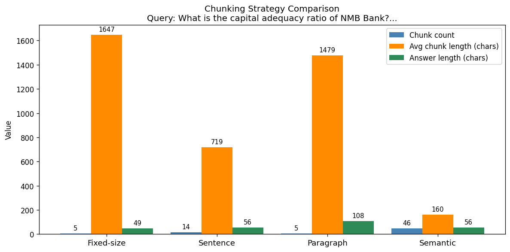

# Section 02: Chunking Strategies for Financial Documents

**Duration:** ~60 minutes  
**Goal:** Understand that *how* you split a document is as important as the retrieval itself, and compare 4 strategies on the same annual report.

---

## Why Chunking Matters

Chunking is like **deciding how to index a book**.

Imagine you are indexing the NMB Bank Annual Report:
- **By sentences** → Very granular. *"Net profit was NPR 2.3 billion"* is one chunk. Good for precise lookups, but loses surrounding context.
- **By chapters** → Very broad. Each chunk is 20 pages. The answer is buried inside — retrieval is noisy.
- **By fixed size** → Predictable. Sometimes cuts mid-sentence or mid-table.
- **By meaning** → Best of both worlds. Chunks end where the topic naturally ends.

For financial documents — which have **tables, footnotes, ratio calculations, and narrative sections** — chunking strategy significantly changes answer quality.

## The 4 Strategies We Will Compare

```
Same PDF Document
       │
       ├──► Fixed-Size Chunking      ──► ChromaDB-1 ──┐
       │                                               │
       ├──► Sentence-Based Chunking  ──► ChromaDB-2 ──┤
       │                                               ├──► Same Query ──► Compare Answers
       ├──► Paragraph-Based Chunking ──► ChromaDB-3 ──┤
       │                                               │
       └──► Semantic Chunking        ──► ChromaDB-4 ──┘
```

| Strategy | Split Logic | Pros | Cons |
|----------|-------------|------|------|
| **Fixed-size** | Every N tokens | Predictable, fast | Cuts mid-sentence/mid-table |
| **Sentence-based** | `.`, `?`, `!` | Preserves sentence integrity | Loses multi-sentence context |
| **Paragraph-based** | `\n\n` | Preserves logical sections | Paragraphs vary wildly in length |
| **Semantic** | Cosine distance between sentences | Topic-aware splits | Slower, needs embeddings upfront |


```python
# ── Setup check: verify the sample PDFs are in place ─────────────────────────
import os, subprocess, sys
from pathlib import Path

DATA_DIR = Path("../data").resolve()
PDF_PATHS = [
    DATA_DIR / "annual_reports" / "nmb_bank_annual_report_2023.pdf",
    DATA_DIR / "annual_reports" / "nmb_bank_annual_report_2022.pdf",
    DATA_DIR / "annual_reports" / "nepal_telecom_annual_report_2023.pdf",
]

if any(not p.exists() for p in PDF_PATHS):
    print("Some PDFs missing — running data generator...")
    subprocess.run([sys.executable, str(DATA_DIR / "generate_sample_data.py")],
                   check=True, cwd=str(DATA_DIR))

print("All required PDFs are present.")
if not os.environ.get("OPENAI_API_KEY"):
    print("WARNING: OPENAI_API_KEY is not set.")

```

    All required PDFs are present.


```python
import os
import re
import textwrap
import numpy as np

import chromadb
import nltk
import tiktoken
import pandas as pd
import matplotlib.pyplot as plt
import matplotlib
matplotlib.rcParams["figure.dpi"] = 120

from openai import OpenAI
from pypdf import PdfReader

nltk.download("punkt", quiet=True)
nltk.download("punkt_tab", quiet=True)

client = OpenAI(api_key=os.environ.get("OPENAI_API_KEY"))
EMBED_MODEL = "text-embedding-3-small"
enc = tiktoken.get_encoding("cl100k_base")

# Load the PDF
PDF_PATH = "../data/annual_reports/nmb_bank_annual_report_2023.pdf"
reader = PdfReader(PDF_PATH)
full_text = "\n".join(page.extract_text() or "" for page in reader.pages)
print(f"Loaded {len(reader.pages)} pages, {len(full_text):,} characters.")
```

    Loaded 5 pages, 7,406 characters.


```python
# ── Strategy 1: Fixed-size chunking ──────────────────────────────────────────
def fixed_size_chunks(text: str, chunk_size: int = 500, overlap: int = 50) -> list[str]:
    tokens = enc.encode(text)
    chunks = []
    start = 0
    while start < len(tokens):
        end = min(start + chunk_size, len(tokens))
        chunks.append(enc.decode(tokens[start:end]))
        start += chunk_size - overlap
    return chunks

chunks_fixed = fixed_size_chunks(full_text)

print(f"Fixed-size chunks : {len(chunks_fixed)}")
print(f"Avg length        : {int(np.mean([len(c) for c in chunks_fixed]))} chars")
print()
for i, c in enumerate(chunks_fixed[5:8], start=6):
    print(f"  Chunk {i}: {c[:180].strip()}...\n")
```

    Fixed-size chunks : 5
    Avg length        : 1647 chars
    


```python
# ── Strategy 2: Sentence-based chunking ──────────────────────────────────────
from nltk.tokenize import sent_tokenize

def sentence_chunks(text: str, sentences_per_chunk: int = 5, overlap: int = 1) -> list[str]:
    sentences = sent_tokenize(text)
    chunks = []
    start = 0
    while start < len(sentences):
        end = min(start + sentences_per_chunk, len(sentences))
        chunks.append(" ".join(sentences[start:end]))
        start += sentences_per_chunk - overlap
    return chunks

chunks_sentence = sentence_chunks(full_text)

print(f"Sentence-based chunks : {len(chunks_sentence)}")
print(f"Avg length            : {int(np.mean([len(c) for c in chunks_sentence]))} chars")
print()
for i, c in enumerate(chunks_sentence[5:8], start=6):
    print(f"  Chunk {i}: {c[:180].strip()}...\n")
```

    Sentence-based chunks : 14
    Avg length            : 719 chars
    
      Chunk 6: The Bank issued NPR 2.0 billion of subordinated debentures in Magh 2079 to support Tier 2 capital. Subsidiaries and Associates
    Subsidiary / Associate
    Ownership %
    Principal Activity...
    
      Chunk 7: 2. Liquidity Risk: Tightness in interbank markets during Q2 FY2023 caused short-term funding costs
    to spike by 180 basis points. The Bank has since increased its high-quality liqui...
    
      Chunk 8: Foreign Exchange Risk: Nepal's dependence on imports and remittance inflows exposes the
    Bank to indirect FX risk. Direct FX exposure is limited to NPR 4.2 billion in approved open...
    


```python
# ── Strategy 3: Paragraph-based chunking ─────────────────────────────────────
def paragraph_chunks(text: str, min_length: int = 100, max_length: int = 2000) -> list[str]:
    raw = re.split(r"\n{2,}", text)
    chunks = []
    buffer = ""
    for para in raw:
        para = para.strip()
        if not para:
            continue
        if len(buffer) + len(para) < max_length:
            buffer = (buffer + "\n\n" + para).strip()
        else:
            if len(buffer) >= min_length:
                chunks.append(buffer)
            buffer = para
    if len(buffer) >= min_length:
        chunks.append(buffer)
    return chunks

chunks_para = paragraph_chunks(full_text)

print(f"Paragraph-based chunks : {len(chunks_para)}")
print(f"Avg length             : {int(np.mean([len(c) for c in chunks_para]))} chars")
print()
for i, c in enumerate(chunks_para[5:8], start=6):
    print(f"  Chunk {i}: {c[:180].strip()}...\n")
```

    Paragraph-based chunks : 5
    Avg length             : 1479 chars
    


```python
# ── Strategy 4: Semantic chunking ────────────────────────────────────────────
# Split sentences, embed them, then split where cosine distance between
# consecutive sentences drops sharply (topic shift)

from nltk.tokenize import sent_tokenize

def cosine_sim(a, b):
    a, b = np.array(a), np.array(b)
    return float(np.dot(a, b) / (np.linalg.norm(a) * np.linalg.norm(b) + 1e-9))

def semantic_chunks(
    text: str,
    threshold: float = 0.75,
    window: int = 3,
    max_sentences_per_chunk: int = 15
) -> list[str]:
    sentences = sent_tokenize(text)
    if len(sentences) < 2:
        return sentences

    # Embed all sentences
    print(f"  Embedding {len(sentences)} sentences for semantic chunking...")
    resp = client.embeddings.create(model=EMBED_MODEL, input=sentences)
    embeds = [item.embedding for item in resp.data]

    # Compute similarity between consecutive windows
    split_indices = [0]
    for i in range(window, len(sentences) - window):
        left  = np.mean(embeds[max(0, i-window):i], axis=0)
        right = np.mean(embeds[i:min(len(embeds), i+window)], axis=0)
        sim = cosine_sim(left, right)
        chunk_size_so_far = i - split_indices[-1]
        if sim < threshold or chunk_size_so_far >= max_sentences_per_chunk:
            split_indices.append(i)

    split_indices.append(len(sentences))

    chunks = []
    for i in range(len(split_indices) - 1):
        chunk = " ".join(sentences[split_indices[i]:split_indices[i + 1]])
        if chunk.strip():
            chunks.append(chunk.strip())
    return chunks

print("Running semantic chunking (slowest — embeds every sentence)...")
chunks_semantic = semantic_chunks(full_text)

print(f"Semantic chunks        : {len(chunks_semantic)}")
print(f"Avg length             : {int(np.mean([len(c) for c in chunks_semantic]))} chars")
print()
for i, c in enumerate(chunks_semantic[5:8], start=6):
    print(f"  Chunk {i}: {c[:180].strip()}...\n")
```

    Running semantic chunking (slowest — embeds every sentence)...
      Embedding 54 sentences for semantic chunking...


    Semantic chunks        : 46
    Avg length             : 160 chars
    
      Chunk 6: The policy rate
    was held at 7.0 percent for most of the year, and the cash reserve ratio (CRR) was retained at 4.0
    percent....
    
      Chunk 7: Despite these headwinds, NMB Bank maintained healthy net interest margins of 4.3 percent
    compared to 4.1 percent in FY2022....
    
      Chunk 8: Deposit and Lending Growth
    Total deposits grew by NPR 21.46 billion to reach NPR 251.64 billion. Retail deposits contributed 62
    percent of the deposit base, demonstrating the stick...
    


```python
# Build 4 ChromaDB collections, one per strategy
chroma_client = chromadb.Client()

def build_collection(name: str, chunks: list[str]) -> chromadb.Collection:
    col = chroma_client.create_collection(name=name, metadata={"hnsw:space": "cosine"})
    # Embed in batches
    embeddings = []
    for i in range(0, len(chunks), 100):
        batch = chunks[i:i+100]
        resp = client.embeddings.create(model=EMBED_MODEL, input=batch)
        embeddings.extend([item.embedding for item in resp.data])
    col.add(documents=chunks, embeddings=embeddings, ids=[f"{name}_{i}" for i in range(len(chunks))])
    print(f"  Collection '{name}': {col.count()} chunks stored.")
    return col

print("Building ChromaDB collections...")
col_fixed    = build_collection("fixed",    chunks_fixed)
col_sentence = build_collection("sentence", chunks_sentence)
col_para     = build_collection("para",     chunks_para)
col_semantic = build_collection("semantic", chunks_semantic)
print("Done.")
```

    Building ChromaDB collections...


      Collection 'fixed': 5 chunks stored.


      Collection 'sentence': 14 chunks stored.


      Collection 'para': 5 chunks stored.


      Collection 'semantic': 46 chunks stored.
    Done.


```python
# Run the same query across all 4 strategies and compare retrieved chunks
QUERY = "What is the capital adequacy ratio of NMB Bank?"

def query_collection(col: chromadb.Collection, query: str, n: int = 3) -> list[str]:
    q_embed = client.embeddings.create(model=EMBED_MODEL, input=[query]).data[0].embedding
    results = col.query(query_embeddings=[q_embed], n_results=n)
    return results["documents"][0]

strategies = {
    "Fixed-size"   : col_fixed,
    "Sentence"     : col_sentence,
    "Paragraph"    : col_para,
    "Semantic"     : col_semantic,
}

print(f"Query: {QUERY}")
print("=" * 70)

retrieved = {}
for name, col in strategies.items():
    chunks_retrieved = query_collection(col, QUERY)
    retrieved[name] = chunks_retrieved
    print(f"\n── {name} ──")
    for i, c in enumerate(chunks_retrieved, 1):
        print(f"  [{i}] {c[:200].strip()}...")
```

    Query: What is the capital adequacy ratio of NMB Bank?
    ======================================================================


    
    ── Fixed-size ──
      [1] guidelines and the proposed
    Banks and Financial Institutions Act (BAFIA) amendments may affect lending margins in FY2024.
    Independent Auditor's Report
    To the Shareholders of NMB Bank Limited:
    We have...
      [2] 2.41 percent from 2.18 percent the previous year,
    primarily attributable to stress in the tourism and trading portfolios in the first half of the fiscal year.
    Provision coverage was strengthened to 1...
      [3] 2
    Change %
    Total Assets
    298,420
    274,310
    +8.79%
    Total Deposits
    251,640
    230,180
    +9.32%
    Loans and Advances
    212,890
    197,420
    +7.84%
    Total Equity
    32,150
    29,640
    +8.47%
    Net Interest Income
    11,820
    10,440
    +13.2...


    
    ── Sentence ──
      [1] The Bank issued NPR 2.0 billion of subordinated debentures in Magh 2079 to support Tier 2 capital. Subsidiaries and Associates
    Subsidiary / Associate
    Ownership %
    Principal Activity
    NMB Capital Limited...
      [2] Provision coverage was strengthened to 138 percent and write-offs of NPR 412 million were
    undertaken in the second half. We expect NPL ratios to normalise to under 2.20 percent by Q2
    FY2024. Capital a...
      [3] The Risk Management Committee met 6 times
    and reviewed the Bank's risk appetite framework in Chaitra 2079. Director attendance averaged 92
    percent across all meetings. NMB Bank complies with the Corpo...


    
    ── Paragraph ──
      [1] Management Discussion and Analysis (MD&A;)
    Operating Environment
    The Nepalese banking sector navigated a difficult year with the Nepal Rastra Bank (NRB) maintaining
    a tight monetary stance to control...
      [2] NMB Bank Limited
    Annual Report — Fiscal Year 2022/23 (FY2023)
    Registered Office: Babarmahal, Kathmandu, Nepal  |  Company Registration No.: 25478/064/065  |  Listed on: Nepal
    Stock Exchange (NEPSE) —...
      [3] Risk Management — Key Risk Factors
    1. Credit Risk: Concentration in the hydropower and real estate sectors represents 28 percent of
    total loan exposure. A sustained decline in property prices or hydro...


    
    ── Semantic ──
      [1] Capital and Liquidity
    Capital Adequacy Ratio improved to 13.20 percent (FY2022: 12.85 percent), comfortably above the
    Basel III minimum of 11.0 percent set by Nepal Rastra Bank....
      [2] NMB Bank complies with the Corporate Governance Directives issued by Nepal Rastra Bank and the
    Securities Board of Nepal (SEBON). The Bank's Code of Conduct was updated in Bhadra 2079 to
    incorporate e...
      [3] Net profit grew by 9.8 percent year-on-year, total deposits crossed NPR 250 billion, and
    our capital adequacy ratio remained well above the regulatory minimum at 13.2 percent. During the year, the Ban...


```python
# Generate final answers for each strategy and display side-by-side
SYSTEM_PROMPT = (
    "You are a financial analyst assistant. Answer the question based on the provided context. "
    "Be concise — 2–3 sentences max. If unsure, say so."
)

def generate_answer(context_chunks: list[str], query: str) -> str:
    context = "\n\n---\n\n".join(context_chunks)
    resp = client.chat.completions.create(
        model="gpt-4o-mini",
        messages=[
            {"role": "system", "content": SYSTEM_PROMPT},
            {"role": "user",   "content": f"Context:\n{context}\n\nQuestion: {query}"}
        ],
        temperature=0
    )
    return resp.choices[0].message.content

print(f"Query: {QUERY}\n")
answers = {}
for name, chunks_ret in retrieved.items():
    answers[name] = generate_answer(chunks_ret, QUERY)
    print(f"── {name} Strategy ──")
    print(textwrap.fill(answers[name], width=80))
    print()
```

    Query: What is the capital adequacy ratio of NMB Bank?
    


    ── Fixed-size Strategy ──
    The capital adequacy ratio of NMB Bank is 13.20%.
    


    ── Sentence Strategy ──
    The capital adequacy ratio of NMB Bank is 13.20 percent.
    


    ── Paragraph Strategy ──
    The capital adequacy ratio of NMB Bank is 13.20%, which is above the Basel III
    minimum requirement of 11.0%.
    


    ── Semantic Strategy ──
    The capital adequacy ratio of NMB Bank is 13.20 percent.
    


```python
# Visualize: chunk count vs avg length vs answer length per strategy
all_chunks = {
    "Fixed-size" : chunks_fixed,
    "Sentence"   : chunks_sentence,
    "Paragraph"  : chunks_para,
    "Semantic"   : chunks_semantic,
}

names      = list(all_chunks.keys())
counts     = [len(v) for v in all_chunks.values()]
avg_lens   = [int(np.mean([len(c) for c in v])) for v in all_chunks.values()]
ans_lens   = [len(answers[n]) for n in names]

x = np.arange(len(names))
width = 0.28

fig, ax = plt.subplots(figsize=(10, 5))
bars1 = ax.bar(x - width, counts,   width, label="Chunk count",          color="steelblue")
bars2 = ax.bar(x,         avg_lens, width, label="Avg chunk length (chars)", color="darkorange")
bars3 = ax.bar(x + width, ans_lens, width, label="Answer length (chars)",    color="seagreen")

ax.set_xticks(x)
ax.set_xticklabels(names, fontsize=11)
ax.set_ylabel("Value")
ax.set_title(f"Chunking Strategy Comparison\nQuery: {QUERY[:60]}...")
ax.legend()
ax.bar_label(bars1, padding=3, fontsize=9)
ax.bar_label(bars2, padding=3, fontsize=9)
ax.bar_label(bars3, padding=3, fontsize=9)
plt.tight_layout()
plt.show()
```


    

    


## When to Use Which Strategy for Financial Documents

| Question Type | Best Strategy | Reason |
|---------------|---------------|---------|
| Precise number lookup (*"What is the CAR?"*) | **Paragraph** or **Semantic** | Numbers appear in well-formed paragraphs or tables |
| Section summaries (*"Summarize MD&A"*) | **Paragraph** | Keeps narrative sections intact |
| Definition queries (*"What is Tier 1 capital?"*) | **Sentence** | Definitions often appear as standalone sentences |
| Long-form analysis | **Semantic** | Topic boundaries are respected |

**Rule of thumb for CA professionals:**  
> Use **paragraph-based** chunking as your default for narrative sections.  
> Use **fixed-size** when you need speed and predictability.  
> Use **semantic** when answer quality is critical and you can afford the extra embedding cost upfront.


```python
# Second query: Summarize the auditor's observations
# Paragraph-based chunking tends to win here because audit opinions are full paragraphs

QUERY2 = "Summarize the auditor's observations"

print(f"Query: {QUERY2}\n")
for name, col in strategies.items():
    chunks_ret = query_collection(col, QUERY2)
    answer = generate_answer(chunks_ret, QUERY2)
    print(f"── {name} Strategy ──")
    print(textwrap.fill(answer, width=80))
    print()
```

    Query: Summarize the auditor's observations
    


    ── Fixed-size Strategy ──
    The auditor's report indicates that the financial statements of NMB Bank Limited
    for the year ended July 15, 2023, present a true and fair view of the bank's
    financial position and performance, in accordance with Nepal Financial Reporting
    Standards and relevant regulations. Key audit matters included the expected
    credit loss on loans and advances, which involved significant management
    judgment, and the effectiveness of IT systems and controls, particularly
    concerning the new core banking system.
    


    ── Sentence Strategy ──
    The auditor's report indicates that NMB Bank Limited's financial statements for
    the year ended Ashadh 31, 2080 present a true and fair view of its financial
    position and performance, compliant with Nepal Financial Reporting Standards and
    relevant banking regulations. Key audit matters highlighted include the
    significant management judgment involved in determining expected credit loss
    provisions on loans and advances, and the importance of IT systems and controls,
    particularly following the deployment of a new core banking system.
    


    ── Paragraph Strategy ──
    The auditor's report indicates that the financial statements of NMB Bank Limited
    for the year ended July 15, 2023, present a true and fair view in accordance
    with Nepal Financial Reporting Standards and relevant regulations. Key audit
    matters include the significant management judgment involved in determining
    expected credit loss provisions on loans and advances, and the reliance on IT
    systems and controls, which were tested for effectiveness.
    


    ── Semantic Strategy ──
    The provided context does not include specific observations or findings from the
    auditor regarding NMB Bank Limited's financial statements. Therefore, I cannot
    summarize the auditor's observations.
    

