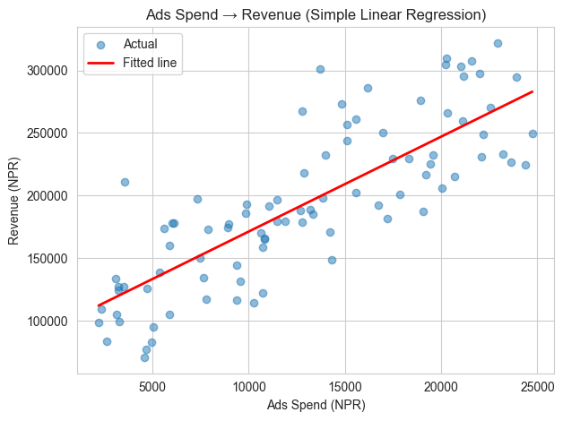
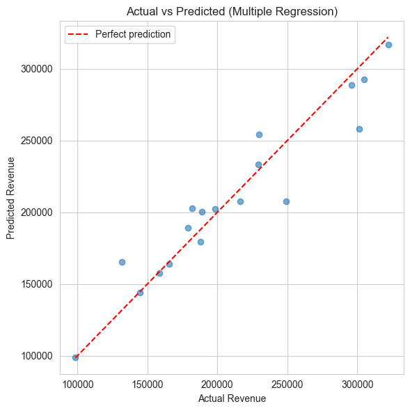

# Notebook 6 — Regression for CA Professionals

**Goal:** Predict a **number** (revenue, expense, loan amount...) based on other columns.

**You will learn:**

1. What regression is — in one minute
2. Train / test split — why we never test on the same data we trained on
3. Simple linear regression — one input, one output
4. Multiple regression — several inputs
5. Measuring how good the model is (MAE, RMSE, R²)
6. Visualising predictions vs actual
7. A short mini-project

> All examples predict daily store revenue from ads spend, footfall, weekend/festival flags — using `data/daily_revenue.csv`.

---

## 1. What is regression?

Regression answers: **"Given some inputs, what number should I expect?"**

Real CA-style examples:
- Predict **next month's revenue** from ad spend, footfall, season.
- Predict **a property's value** from area, location, age.
- Predict **electricity expense** from production output.

The model **learns** the relationship from past data, then applies it to new rows.


```python
import pandas as pd
import numpy as np
import matplotlib.pyplot as plt
import seaborn as sns
sns.set_style("whitegrid")

daily = pd.read_csv("data/daily_revenue.csv")
print("Shape:", daily.shape)
daily.head()
```

    Shape: (90, 6)


<div>
<style scoped>
    .dataframe tbody tr th:only-of-type {
        vertical-align: middle;
    }

    .dataframe tbody tr th {
        vertical-align: top;
    }

    .dataframe thead th {
        text-align: right;
    }
</style>
<table border="1" class="dataframe">
  <thead>
    <tr style="text-align: right;">
      <th></th>
      <th>Date</th>
      <th>Ads_Spend</th>
      <th>Footfall</th>
      <th>Is_Weekend</th>
      <th>Is_Festival</th>
      <th>Revenue</th>
    </tr>
  </thead>
  <tbody>
    <tr>
      <th>0</th>
      <td>2024-07-16</td>
      <td>17479.0</td>
      <td>321</td>
      <td>0</td>
      <td>0</td>
      <td>229308.0</td>
    </tr>
    <tr>
      <th>1</th>
      <td>2024-07-17</td>
      <td>20050.0</td>
      <td>229</td>
      <td>0</td>
      <td>0</td>
      <td>206190.0</td>
    </tr>
    <tr>
      <th>2</th>
      <td>2024-07-18</td>
      <td>20294.0</td>
      <td>462</td>
      <td>0</td>
      <td>1</td>
      <td>309754.0</td>
    </tr>
    <tr>
      <th>3</th>
      <td>2024-07-19</td>
      <td>4684.0</td>
      <td>190</td>
      <td>0</td>
      <td>0</td>
      <td>77360.0</td>
    </tr>
    <tr>
      <th>4</th>
      <td>2024-07-20</td>
      <td>9358.0</td>
      <td>182</td>
      <td>1</td>
      <td>0</td>
      <td>144554.0</td>
    </tr>
  </tbody>
</table>
</div>


## 2. Train / Test split — the golden rule

Never check a model against the same rows you taught it. Split your data into two parts:

| Subset | Use                                |
|--------|------------------------------------|
| Train  | The model **learns** from this data |
| Test   | We check the model on data it has never seen |

A typical split is **80% train, 20% test**.


```python
from sklearn.model_selection import train_test_split

X = daily[["Ads_Spend"]]   # input column(s) — must be 2-D
y = daily["Revenue"]       # what we want to predict

X_train, X_test, y_train, y_test = train_test_split(
    X, y, test_size=0.2, random_state=42)

print("Train rows:", len(X_train))
print("Test  rows:", len(X_test))
```

    Train rows: 72
    Test  rows: 18


## 3. Simple linear regression — one input

The model learns the line:  `Revenue = m × Ads_Spend + c`


```python
from sklearn.linear_model import LinearRegression

model = LinearRegression()
model.fit(X_train, y_train)

print(f"Slope (m): {model.coef_[0]:.2f}")
print(f"Intercept (c): {model.intercept_:.0f}")
print(f"→ Equation: Revenue = {model.coef_[0]:.2f} * Ads_Spend + {model.intercept_:.0f}")
```

    Slope (m): 7.58
    Intercept (c): 95465
    → Equation: Revenue = 7.58 * Ads_Spend + 95465


```python
# Predict on the held-out test set
y_pred = model.predict(X_test)

pd.DataFrame({"Actual": y_test.values[:10],
              "Predicted": y_pred[:10].round(0)}).head(10)
```


<div>
<style scoped>
    .dataframe tbody tr th:only-of-type {
        vertical-align: middle;
    }

    .dataframe tbody tr th {
        vertical-align: top;
    }

    .dataframe thead th {
        text-align: right;
    }
</style>
<table border="1" class="dataframe">
  <thead>
    <tr style="text-align: right;">
      <th></th>
      <th>Actual</th>
      <th>Predicted</th>
    </tr>
  </thead>
  <tbody>
    <tr>
      <th>0</th>
      <td>301305.0</td>
      <td>199253.0</td>
    </tr>
    <tr>
      <th>1</th>
      <td>165756.0</td>
      <td>177601.0</td>
    </tr>
    <tr>
      <th>2</th>
      <td>304694.0</td>
      <td>248972.0</td>
    </tr>
    <tr>
      <th>3</th>
      <td>198129.0</td>
      <td>200542.0</td>
    </tr>
    <tr>
      <th>4</th>
      <td>229308.0</td>
      <td>227979.0</td>
    </tr>
    <tr>
      <th>5</th>
      <td>158795.0</td>
      <td>176699.0</td>
    </tr>
    <tr>
      <th>6</th>
      <td>179067.0</td>
      <td>192347.0</td>
    </tr>
    <tr>
      <th>7</th>
      <td>216391.0</td>
      <td>240920.0</td>
    </tr>
    <tr>
      <th>8</th>
      <td>131883.0</td>
      <td>167783.0</td>
    </tr>
    <tr>
      <th>9</th>
      <td>249144.0</td>
      <td>263748.0</td>
    </tr>
  </tbody>
</table>
</div>


### Practice 1
Use the model to predict the revenue when `Ads_Spend = 10,000`.

Hint: call `model.predict(pd.DataFrame({"Ads_Spend":[10000]}))`.


```python
# Your turn:
```

<details><summary>Show solution</summary>


```python
new_input = pd.DataFrame({"Ads_Spend":[10000]})
print("Predicted revenue:", model.predict(new_input)[0].round(0))
```

    Predicted revenue: 171278.0


</details>

## 4. How good is the model? — MAE, RMSE, R²

| Metric  | Meaning                                            | Better when |
|---------|----------------------------------------------------|-------------|
| **MAE** | Mean Absolute Error — avg NPR difference          | smaller     |
| **RMSE**| Root Mean Squared Error — penalises big mistakes  | smaller     |
| **R²**  | % of variation in revenue the model explains      | closer to 1 |


```python
from sklearn.metrics import mean_absolute_error, mean_squared_error, r2_score

mae  = mean_absolute_error(y_test, y_pred)
rmse = np.sqrt(mean_squared_error(y_test, y_pred))
r2   = r2_score(y_test, y_pred)

print(f"MAE  : NPR {mae:,.0f}")
print(f"RMSE : NPR {rmse:,.0f}")
print(f"R²   : {r2:.3f}    ({r2*100:.1f}% of variation explained)")
```

    MAE  : NPR 25,929
    RMSE : NPR 35,997
    R²   : 0.666    (66.6% of variation explained)


## 5. Visualising the fit

The scatter shows actual points; the red line is what the model learned.


```python
plt.scatter(daily["Ads_Spend"], daily["Revenue"], alpha=0.5, label="Actual")
xs = np.linspace(daily["Ads_Spend"].min(), daily["Ads_Spend"].max(), 50)
ys = model.predict(pd.DataFrame({"Ads_Spend": xs}))
plt.plot(xs, ys, color="red", linewidth=2, label="Fitted line")
plt.xlabel("Ads Spend (NPR)")
plt.ylabel("Revenue (NPR)")
plt.title("Ads Spend → Revenue (Simple Linear Regression)")
plt.legend()
plt.tight_layout()
plt.show()
```


    

    


## 6. Multiple regression — using several inputs

Real revenue depends on more than just ads spend. Add **footfall**, **weekend** and **festival** flags and let the model use all of them at once.


```python
X = daily[["Ads_Spend", "Footfall", "Is_Weekend", "Is_Festival"]]
y = daily["Revenue"]

X_tr, X_te, y_tr, y_te = train_test_split(X, y, test_size=0.2, random_state=42)

multi = LinearRegression().fit(X_tr, y_tr)

# Coefficients tell us the impact of each input
coefs = pd.Series(multi.coef_, index=X.columns).round(2)
print("Intercept :", multi.intercept_.round(2))
print(coefs.to_string())
```

    Intercept : 7106.53
    Ads_Spend          8.09
    Footfall         264.64
    Is_Weekend     12921.49
    Is_Festival    35531.46


```python
y_pred = multi.predict(X_te)
print(f"MAE  : NPR {mean_absolute_error(y_te, y_pred):,.0f}")
print(f"RMSE : NPR {np.sqrt(mean_squared_error(y_te, y_pred)):,.0f}")
print(f"R²   : {r2_score(y_te, y_pred):.3f}")
```

    MAE  : NPR 13,242
    RMSE : NPR 18,856
    R²   : 0.908


### Practice 2
Use the **multiple** model to predict revenue for a day with:
- Ads_Spend = 12,000
- Footfall = 300
- Is_Weekend = 0
- Is_Festival = 1


```python
# Your turn:
```

<details><summary>Show solution</summary>


```python
new_day = pd.DataFrame({
    "Ads_Spend":[12000],
    "Footfall":[300],
    "Is_Weekend":[0],
    "Is_Festival":[1],
})
print("Predicted revenue:", multi.predict(new_day)[0].round(0))
```

    Predicted revenue: 219075.0


</details>

## 7. Actual vs Predicted — diagnostic plot

A good model has its dots **close to the 45-degree line**.


```python
plt.figure(figsize=(6,6))
plt.scatter(y_te, y_pred, alpha=0.6)
lims = [min(y_te.min(), y_pred.min()), max(y_te.max(), y_pred.max())]
plt.plot(lims, lims, "r--", label="Perfect prediction")
plt.xlabel("Actual Revenue")
plt.ylabel("Predicted Revenue")
plt.title("Actual vs Predicted (Multiple Regression)")
plt.legend()
plt.tight_layout()
plt.show()
```


    

    


## 8. Mini-Project — predict monthly company revenue

Imagine you are given the past 12 months data:

| Month | Marketing_Spend | Salesmen | Units_Sold | Revenue |
|------|---|---|---|---|


```python
toy = pd.DataFrame({
    "Marketing_Spend":[50000,55000,60000,45000,70000,80000,75000,85000,90000,100000,110000,120000],
    "Salesmen":       [5, 5, 6, 6, 7, 7, 7, 8, 8, 9, 9, 10],
    "Units_Sold":     [420, 465, 510, 380, 540, 605, 580, 660, 700, 760, 820, 880],
    "Revenue":        [1250000, 1380000, 1520000, 1120000, 1620000, 1780000, 1700000,
                       1950000, 2080000, 2250000, 2400000, 2580000],
})
toy
```


<div>
<style scoped>
    .dataframe tbody tr th:only-of-type {
        vertical-align: middle;
    }

    .dataframe tbody tr th {
        vertical-align: top;
    }

    .dataframe thead th {
        text-align: right;
    }
</style>
<table border="1" class="dataframe">
  <thead>
    <tr style="text-align: right;">
      <th></th>
      <th>Marketing_Spend</th>
      <th>Salesmen</th>
      <th>Units_Sold</th>
      <th>Revenue</th>
    </tr>
  </thead>
  <tbody>
    <tr>
      <th>0</th>
      <td>50000</td>
      <td>5</td>
      <td>420</td>
      <td>1250000</td>
    </tr>
    <tr>
      <th>1</th>
      <td>55000</td>
      <td>5</td>
      <td>465</td>
      <td>1380000</td>
    </tr>
    <tr>
      <th>2</th>
      <td>60000</td>
      <td>6</td>
      <td>510</td>
      <td>1520000</td>
    </tr>
    <tr>
      <th>3</th>
      <td>45000</td>
      <td>6</td>
      <td>380</td>
      <td>1120000</td>
    </tr>
    <tr>
      <th>4</th>
      <td>70000</td>
      <td>7</td>
      <td>540</td>
      <td>1620000</td>
    </tr>
    <tr>
      <th>5</th>
      <td>80000</td>
      <td>7</td>
      <td>605</td>
      <td>1780000</td>
    </tr>
    <tr>
      <th>6</th>
      <td>75000</td>
      <td>7</td>
      <td>580</td>
      <td>1700000</td>
    </tr>
    <tr>
      <th>7</th>
      <td>85000</td>
      <td>8</td>
      <td>660</td>
      <td>1950000</td>
    </tr>
    <tr>
      <th>8</th>
      <td>90000</td>
      <td>8</td>
      <td>700</td>
      <td>2080000</td>
    </tr>
    <tr>
      <th>9</th>
      <td>100000</td>
      <td>9</td>
      <td>760</td>
      <td>2250000</td>
    </tr>
    <tr>
      <th>10</th>
      <td>110000</td>
      <td>9</td>
      <td>820</td>
      <td>2400000</td>
    </tr>
    <tr>
      <th>11</th>
      <td>120000</td>
      <td>10</td>
      <td>880</td>
      <td>2580000</td>
    </tr>
  </tbody>
</table>
</div>


**Your tasks:**

1. Split the data into train (80%) and test (20%) — use `random_state=0`.
2. Fit a `LinearRegression` using all three inputs.
3. Print the coefficients of each input.
4. Report MAE, RMSE and R² on the test set.
5. Predict the revenue for a month with: Marketing_Spend = 95,000, Salesmen = 9, Units_Sold = 750.


```python
# Your code here
```

<details><summary>Show solution</summary>


```python
from sklearn.model_selection import train_test_split
from sklearn.linear_model import LinearRegression
from sklearn.metrics import mean_absolute_error, mean_squared_error, r2_score

X = toy[["Marketing_Spend","Salesmen","Units_Sold"]]
y = toy["Revenue"]

X_tr, X_te, y_tr, y_te = train_test_split(X, y, test_size=0.2, random_state=0)

m = LinearRegression().fit(X_tr, y_tr)
print("Coefs   :", dict(zip(X.columns, m.coef_.round(2))))
print("Intercept:", m.intercept_.round(2))

p = m.predict(X_te)
print()
print(f"MAE  : {mean_absolute_error(y_te, p):,.0f}")
print(f"RMSE : {np.sqrt(mean_squared_error(y_te, p)):,.0f}")
print(f"R²   : {r2_score(y_te, p):.3f}")

new_month = pd.DataFrame({"Marketing_Spend":[95000],"Salesmen":[9],"Units_Sold":[750]})
print("\nPredicted revenue:", m.predict(new_month)[0].round(0))
```

    Coefs   : {'Marketing_Spend': np.float64(-4.46), 'Salesmen': np.float64(1300.18), 'Units_Sold': np.float64(3576.44)}
    Intercept: -41061.98
    
    MAE  : 15,013
    RMSE : 19,613
    R²   : 0.998
    
    Predicted revenue: 2229479.0


</details>

---
### What's next?
Now we can predict numbers. The final notebook (`07_Classification`) tackles the other big question — **predicting categories** (yes/no, default/not, fraud/not). The workflow is the same; only the metric changes.
